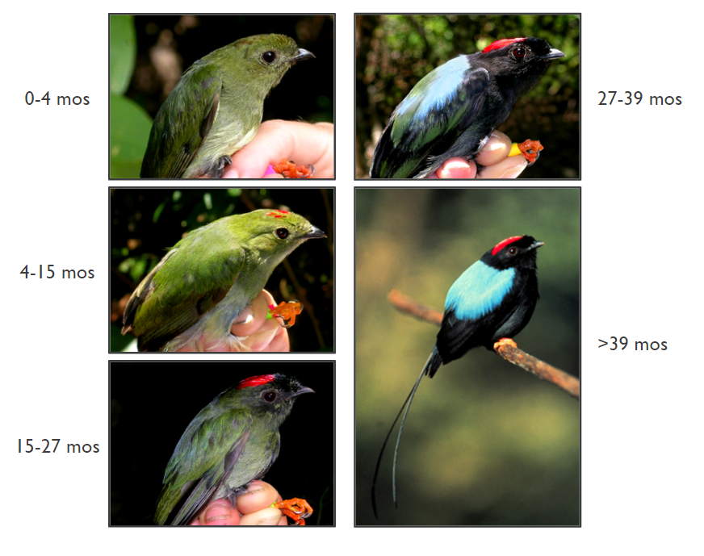
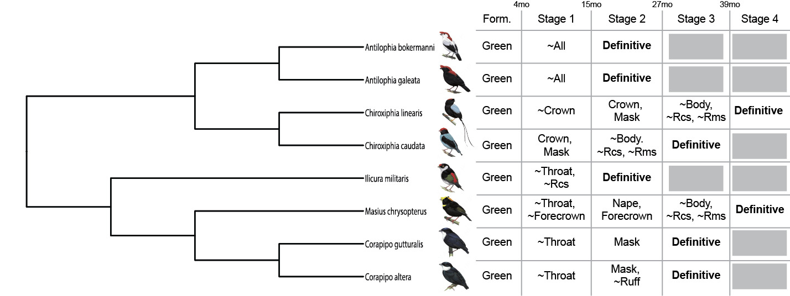

# Phylogenetic Biology - EEB 654 - Final Project

# Proposal Commit - 10/06/2020

# Ontogenetic Phylogenetics, and the Evolution of Delayed Plumage Maturation in Manakins

## Introduction and Goals

**NOTE** The information in this proposal will be added to a R Bookdown document hosted on this github repository in the coming days. I’ll consider it a generous gift to the world that I have presently removed a multi-page introductory rant on "Ontogeny and Life History Evolution,"" which is getting to the point that even my mom does not want to hear it. Is this what being a graduate student means?

#### Ontogeny and Phylogeny
The study of the relationship between ontogeny and phylogeny is as old as the concepts themselves. In the 1820's, von Baer conceived of taxonomic relationships with the conjecture that development evolved by the specialization of adult forms out of general embryonic ones (Abzhanov 2013). With von Baer’s conjecture, taxonomies could be reconstructed based on traits shared early in development. By the 1860's, Haeckel conceived of phylogenetic relationships per se with the conjecture that development evolves through the speeding of ancestral trajectories with the terminal addition of new ones (Gould 1977). With Haeckel’s conjecture, phylogenetic relationships could be reconstructed based on the ways in which developmental trajectories recapitulated a chain of ancestral forms. Both of these conjectures were assumptions about the process of developmental evolution such that embryos might be used as a tool for taxonomists.

Gould (1977) and Alberch et al. (1979) shifted this perspective to focus on the variety of processes of developmental evolution that emerge from changes in the timing or rate of growth. Fink (1982) formalized these approaches in the context of an a priori phylogenetic pattern, demonstrating that questions about the evolution of development were indeed questions about processes that might be answered with phylogenetic patterns, as opposed to clues to those patterns themselves. After nearly 200 years of conjecture and taxonomy, the joint study of ontogeny and phylogeny can now investigate the actual relationship between developmental evolution and evolution more generally.

#### The Evolution of Delayed Plumage Maturation
My goal is to investigate one small process of developmental evolution in one small group of birds: the evolution of delayed plumage maturation (DPM) in manakins (Aves: Pipridae). In birds with DPM, younger individuals develop drab, juvenile-like, “predefinitive” plumages whereas older individuals molt into the colorful “definitive” plumages that characterize increased reproductive effort and success (Hawkins et al. 2012).

The images below show the platinum edition of DPM, that of the Long-tailed Manakin (Doucet et al. 2007). Each photo shows the plumage stage of male individuals who incorporate more definitive-like elements as they re-moult their feathers each year.

Delayed plumage maturation is a phenomenon with two axes of evolutionary change. The first axis involves an internal ontogenetic process (the “delayed maturation” part of DPM) -- how long does it take for a young bird to reach the definitive plumage stage? In the Long-tailed Manakins above, the answer is three years, with three intermediate predefinitive plumage stages. The second axis involves an external, or social, signaling process (the “plumage” part of DPM) -- what does the bird look like at each stage? For Long-tailed Manakins in their first predefinitive plumage stage (~4-15 months), the answer is “green with a red cap.”

Thus far, DPM research has focused on testing for direct advantages of predefinitive plumages (i.e., “why is it good to be green?”), rather than focusing on the processes of evolution or selection that can actually result in delayed maturation (e.g., Rohwer 1983, Lyon and Montgomerie 1986). I hope to reorient the study of DPM towards the study of developmental evolution, as opposed to the study of proximate signalling processes.

Studies of DPM as a developmental process are exceedingly rare and preliminary (Collis and Borgia 1993, Prum and Razafindratsita 1997). Studies of DPM in a phylogenetic context are also exceedingly rare (Chu 1994, Hill 1996). Studies of DPM as a developmental process in a phylogenetic context are non-existent. A phylogenetic analysis of DPM will be an phylogenetic analysis of ontogeny in the true sense of Fink (1982). I do not want to use plumage patterns to make hypotheses about phylogenies. I want to use phylogenies to understand the evolution of plumage trajectories.

####Goals, data, and methods
My initial goals for this project are as follows:
1. Establish a **Data Ontology** for DPM that allows me to compare both the number of plumage stages and the qualities of plumages across the well-resolved phylogeny of manakins.
2. Build a **Structured Markov Model** for the evolution of these two tiers of developmental characters.
3. Perform **Ancestral State Reconstruction** for these hierarchically structured characters.

I don’t know how to do anything of these things correctly yet, so this might even be fun!

**Goal One: Data Ontology**
The phylogeny of manakins has been robustly estimated with molecular data from almost all of the ~65 members of the clade (Ohlson et al. in prep, see also Ohlson et al. 2013). This backbone phylogeny provides the pattern with which I might investigate the process of the evolution of DPM. For my part, the first step is to establish a data ontology that allows me to compare characters across taxa. I need two tiers to define these data: (1) What is the length of DPM for each taxon (e.g., how many plumage stages are there)? (2) What are the qualities of plumages at each stage? I will first collect data for all species present in the molecular tree using literature reports, and then verify uncertain reports using museum specimens. For possible downstream analyses, I will supplement these data with information on sexual dimorphism, sexual behavior, and mating systems.

As an example, consider some DPM characters loosely annotated for a handful of manakins, below. Different taxa differ both in the number of predefinitive plumage stages and the qualities of the plumages at each stage (here indicated with the particular definitive-like qualities that are present at each stage).

**Goal Two: Structured Markov Models**
Phylogenetic analyses of ontogenetic processes face a problem in that the qualities of particular characters are causally dependent on the presence or absence of those characters. The classic example of this problem is the “tail color problem” (Maddison 1993). Imagine trying to study the evolution of tail color in a clade of organisms whose members have either red tails, blue tails, or no tails. What is the relationship between a red-tailed taxon and a no-tailed taxon, as compared to the relationship between a red-tailed taxon and a blue-tailed taxon? In the context of DPM, there is a similar challenge: what is the relationship between plumage evolution at a given stage, and the developmental evolution of the presence or absence of stages themselves?

These multiple axes of evolutionary change have a strict hierarchical structure. Observations of evolutionary shifts in tail color are causally subordinate to shifts in the presence or absence of tails. Recently, Tarasov (2019) established a solution to this problem using Structured Markov Models. Such a model allows one to differentiate between observable states (e.g., blue tail, red tail, no tail) and the hidden processes of change among those states (which, e.g., includes the evolution of tails as well as the evolution of tail colors). Thus, an additional portion of my data ontology will be not just the matrix of observable characters, but also the explicit dependencies of those characters.

**Goal Three: Ancestral State Reconstruction**
I anticipate that a greater knowledge of Structured Markov Models in a phylogenetic context will open the door to multiple forms of analyses. In particular, I am interested in how such an explicit model could help me assess the variable role of selection at different levels of the structured evolutionary hierarchy (e.g., what if there are different forms of selection operating in regards to the number of plumage stages and the qualities of plumages at those stages?).

Given my current naiveté, however I want to begin with a simpler goal: modeling the ancestral states of DPM in manakins. After establishing the character dependencies in my Structured Markov Model, I can use the new R package [PARAMO](https://github.com/sergeitarasov/PARAMO) in combination with RevBayes (Höhna et al. 2016) to infer the history of evolution of plumage stages and plumage qualities at each stage. By the end of these initial goals, I will have established not only a dataset of DPM characters in manakins, but also explicit model(s) for the dependencies among these characters, and set these data to the reconstruction of the ancestral states of DPM in these birds.

## References
Abzhanov, A. 2013. von Baer’s law for the ages: lost and found principles of developmental evolution. Trends in Genetics 29:712–722.

Alberch, P., S. J. Gould, G. F. Oster, and D. B. Wake. 1979. Size and shape in ontogeny and phylogeny. Paleobiology:296–317.

Chu, P. C. 1994. Historical examination of delayed plumage maturation in the shorebirds (Aves: Charadriiformes). Evolution 48:327–350.

Collis, K., and G. Borgia. 1993. The Costs of Male Display and Delayed Plumage Maturation in the Satin Bowerbird (*Ptilonorhynchus violaceus*). Ethology 94:59–71.

Doucet, S. M., D. B. McDonald, M. S. Foster, and R. P. Clay. 2007. Plumage development and molt in Long-tailed Manakins (*Chiroxiphia linearis*): variation according to sex and age. The Auk 124:29–43.

Fink, W. L. 1982. The conceptual relationship between ontogeny and phylogeny. Paleobiology 8:254–264.

Gould, S. J. 1977. Ontogeny and phylogeny. Harvard University Press.

Hawkins, G. L., G. E. Hill, and A. Mercadante. 2012. Delayed plumage maturation and delayed reproductive investment in birds. Biological Reviews 87:257–274.

Hill, G. E. 1996. Subadult Plumage in the House Finch and Tests of Models for the Evolution of Delayed Plumage Maturation. The Auk: Ornithological Advances 113:858–874.

Höhna, S., M. J. Landis, T. A. Heath, B. Boussau, N. Lartillot, B. R. Moore, J. P. Huelsenbeck, and F. Ronquist. 2016. RevBayes: Bayesian phylogenetic inference using graphical models and an interactive model-specification language. Systematic biology 65:726–736.

Lyon, B. E., and R. D. Montgomerie. 1986. Delayed plumage maturation in passerine birds: Reliable signaling by subordinate males? Evolution 40:605–615.

Maddison, W. P. 1993. Missing Data Versus Missing Characters in Phylogenetic Analysis. Systematic Biology 42:576–581.

Ohlson, J. I., J. Fjeldsa, and P. G. Ericson. 2013. Molecular phylogeny of the manakins (Aves: Passeriformes: Pipridae), with a new classification and the description of a new genus. Molecular phylogenetics and evolution 69:796–804.

Prum, R., and V. R. Razafindratsita. 1997. Lek behavior and natural history of the Velvet Asity (*Philepina castanea*: Eurylaimidae). The Wilson Bulletin 109:371–560.

Rohwer, S. 1983. Testing the female mimicry hypothesis of delayed plumage maturation: a comment on Procter-Gray and Holmes. Evolution 37:421–423.

Tarasov, S. 2019. Integration of Anatomy Ontologies and Evo-Devo Using Structured Markov Models Suggests a New Framework for Modeling Discrete Phenotypic Traits. Systematic Biology 68:698–716.
