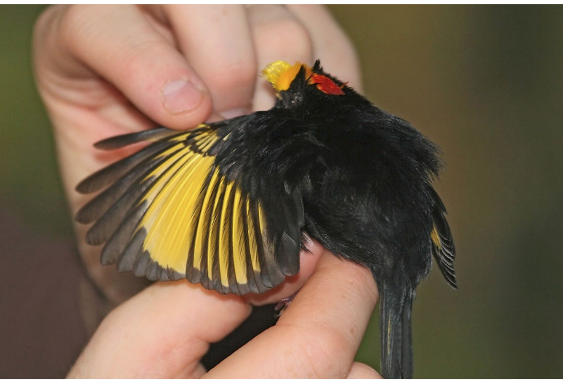
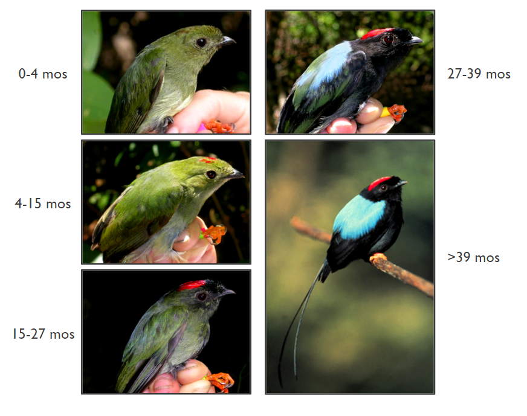
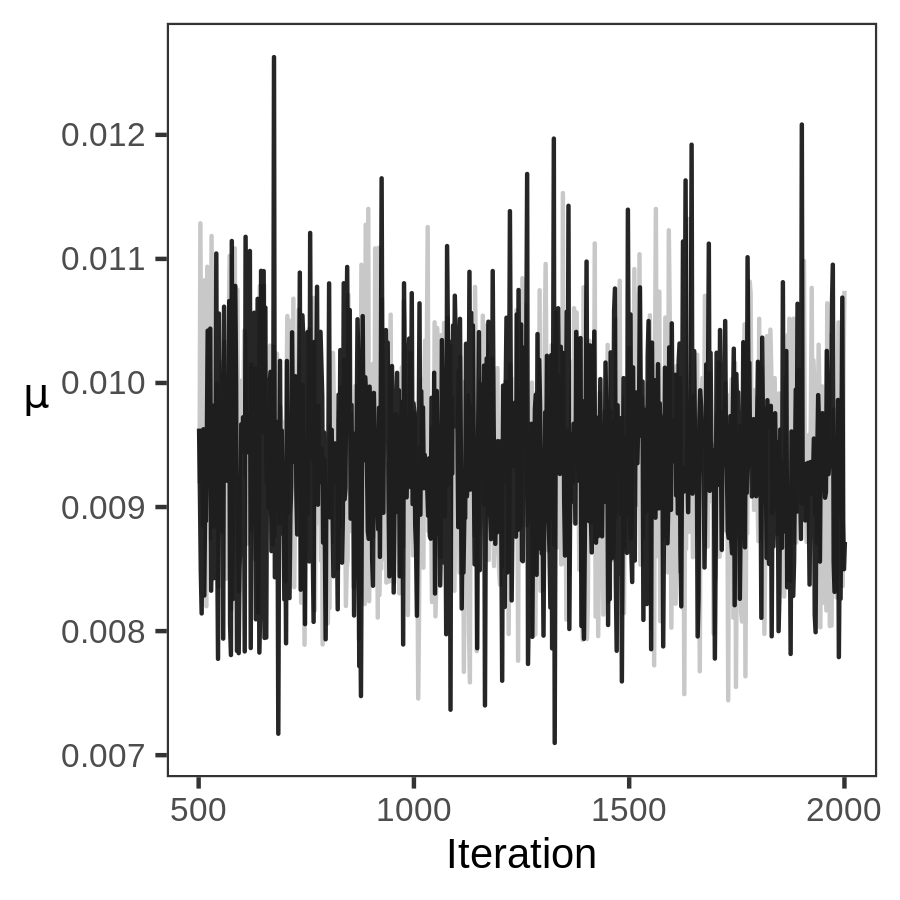
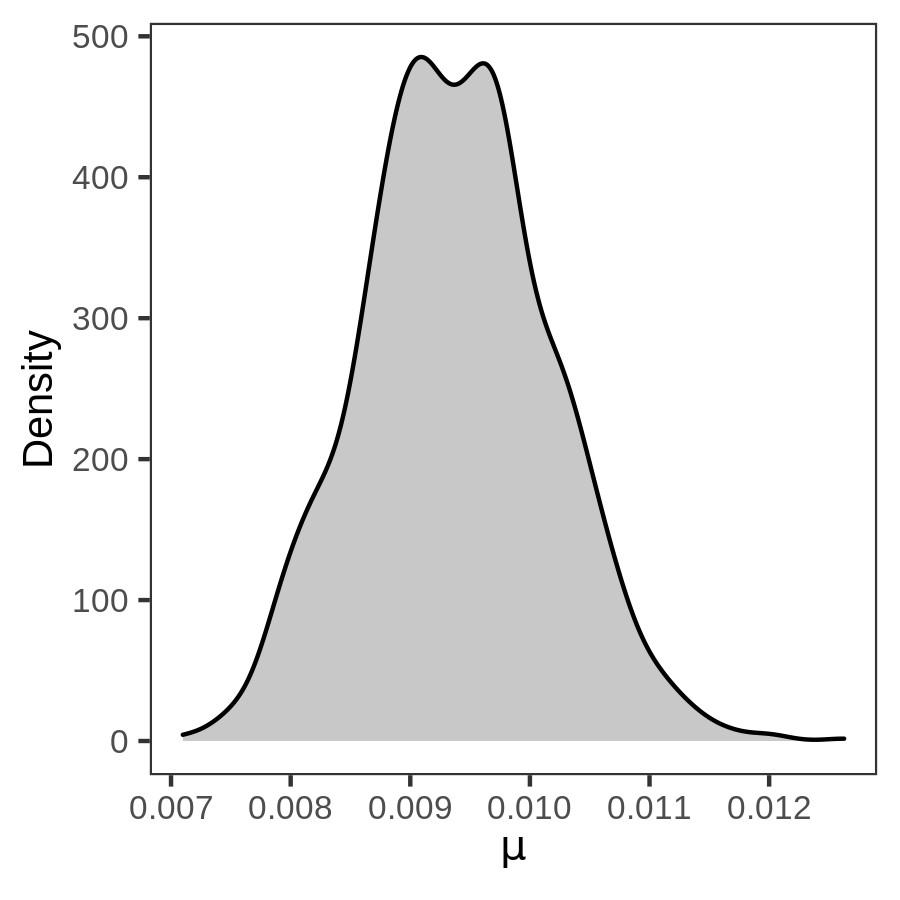
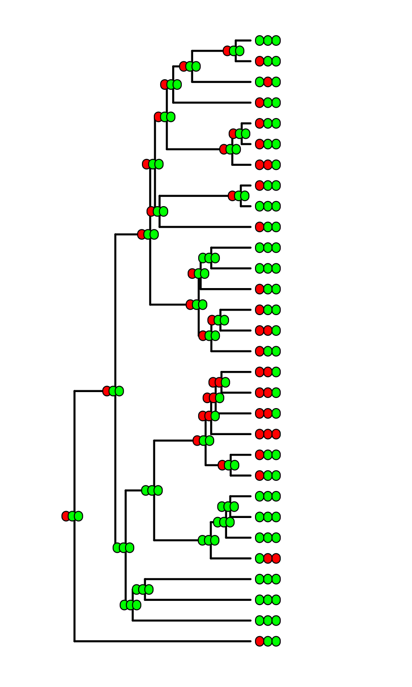

# Phylogenetic Biology - EEB 654 - Final Project

# Minimum Viable Analysis Commit - 2020-11-03

# Ontogenetic Phylogenetics, and the Evolution of Delayed Plumage Maturation in Manakins

## Minimum Viable Analysis Description
For this checkpoint, I have developed an initial process for coding and wrangling plumage characters across and within taxa and performed a symmetric unordered ancestral state reconstruction in RevBayes given a preliminary tree. Character "alignment," ancestral state reconstruction, and plots are all automated by the bash script ```mva.sh```.

### Plumage Characters
Plumage characters are most intuitively coded as "patches": a red crown, an elongated rectrix, etc. But this qualitative coding regime is both convenient *and* necessary. This is because plumage characters are not individual developmental units that can be parsed on a universal and generalized "bird." Instead, a plumage character is a unit of dynamic *covariation* between different avian appendages and sub-appendages. Prum and Dyke (2003) dubbed this unit of covariation a "metamodule," and made clear that it is not reducible to any individual underlying phenotypic process (e.g., made clear that it is nothing like a "gene"). Here are two examples that illustrate this problem.

Golden-winged Manakins (*Masius chrysopterus*) clearly have a yellow wingpatch. This wing patch is not the result of a color aligned with any particular feather tract (pterlyae), a color aligned with any particular feather, or a color aligned with any particular barb. Instead, the presence of a coherent wing patch here is due to carotenoid deposition in *individual barbules* that, first, hook with other barbules of different barbs on the same feather to form a flat patch within a broader vane and, second, correspond with *individuals barbules* engaging in the same phenomena of covariation on different feathers to form a coherent flat patch across vanes [as Prum and Dyke (2003) note, it is also both telling and exciting that a yellow patch is developed in the same way on the rectrices of these birds!]. As far as I can tell, recognizing this yellow patch as a character seems feasible with one of four strategies: (1) establish a data structure which contains information about all individual barbules within a bird, and then aggregate patterns of covariation across those barbules; (2) establish a data structure which contains the relevant developmental signaling information through which feathers develop across the body of each bird; (3) look at a wing and see that part of it is yellow. I have chosen that final strategy.


As a second illustration, consider the delayed plumage maturation sequence of the Long-tailed Manakin (*Chiroxiphia linearis*). In their second predefinitive plumage stage (bottom left in the image below), young males have a black mask. The presence of this black mask as a plumage character is a product of covaration between black feathers *and* green feathers. Just as the mask is not present as a character from ages 0-15 months because some feathers are green rather than black, the mask is also not present as a character from 27 months onwards because some feathers are *black rather than green*.


These "disappearing" developmental features push me forward in two ways. First, I was previously confident that "developmental dependency" would instill a necessary constraint on a comparative analysis of developmental characters because, for example, a young bird could not have a character that was more elaborate than, or absent in, an older bird of the same taxon. I can no longer defend this claim, which simplifies my analysis of character evolution by removing the need for an underlying hierarchical markov model structure for trait inter-dependence. Second, the idea that developmental trajectories cannot be simply summarized by a continuous process of "accumulation" pulls us away from the classical understanding of the relationship between ontogeny and phylogeny (e.g., Gould 1977, Alberch et al. 1979) that formulates development as an issue of mere *rate* and *period*.

Although coding all of these characters rigorously and reliably will require more thought, for this checkpoint I have attempted to code the obvious plumage patches of a handful of manakin species in the Ilicurini subclade of manakins (including genera such as *Masius* and *Chiroxiphia*). I combined published literature reports with encyclopedic entries and images available from [The Birds of the World](https://birdsoftheworld.org/bow/home) database. Citations for each of the 15 initial taxa are listed in the table below.

| Taxon | Citations |
|-------|-----------|
|*Tyranneutes stolzmanni*| Hellmayr (1929), BotW |
|*Tyranneutes virescens*| Hellmayr (1929), BotW |
|*Neopelma pallescens* | Hellmayr (1929), BotW |
|*Neopelma aurifrons* | Hellmayr (1929), BotW |
|*Neopelma chrysolophum* | Hellmayr (1929), BotW |
|*Chloropipo flavicapilla* | Hellmayr (1926), BotW |
|*Antilophia galeata* | Marini and Cavalcanti (1992), Gaiotti (2016) |
|*Chiroxiphia linearis* | Foster (1987), Duval (2005), Doucet (2007) |
|*Chiroxiphia lanceolata* | Duval (2005) |
|*Chiroxiphia pareola* | Cárdenas‐Posada et al. (2018) |
|*Chiroxiphia caudata* | Mallet-Rodrigues and Dutra (2012) |
|*Ilicura militaris* | Anciães (2005) |
|*Masius chrysopterus* | BotW |
|*Corapipo gutturalis* | Prum (1986), Aramuni et al. (2019) |
|*Corapipo leucorrhoa* | Rosselli (1994) |


For each taxon, I reviewed predefinitive and definitive plumage stages. These stages are aligned across all taxa due to the single annual, and presumably homologous, molts that produce them. For each individual, I coded plumage patches with one of three states: 0, 1, or 2. A character state of 2 indicates the presence of a fully-developed plumage patch (either color or structure), while a character state of 1 indicates the presence of a patch which is shows variation within a patch, variation across individuals, or lesser elaboration of the same structures present in a subsequent patch.

For example, here is the first pass at coding the plumage patches of *Chiroxiphia linearis*:
|Character|S1|S2|S3|S4|
|---------|--|--|--|--|
|Crown|1|1|2|2|
|Rectrices [inner elongated]|1|1|1|2|
|Mask|0|1|0|0|
|Body|0|0|1|2|
|Mantle|0|0|1|2|
|Remiges|0|0|1|0|
|Rectrices [color]|0|0|1|0|

Other taxa have simpler plumage characters and developmental trajectories. For example, here a first pass at coding the plumage patches of *Corapipo gutturalis* (note again the disappearing mask):
|Character|S1|S2|
|---------|--|--|
|Throat|2|2|
|Mask|2|0|
|Body|0|2|

The last plumage stage for each individual taxon is taken as that taxon's "definitive plumage." The set of plumage characters is then filled in to equal the maximum stage across all taxa. For example, *Chiroxiphia linearis* has four stages whereas *Corapipo gutturalis* only has two. After aligning all taxa with this maximum, the coding for *C. gutturalis* is filled in with additional definitive plumage patches:
|Character|S1|S2|S3|S4|
|---------|--|--|--|--|
|Throat|2|2|2|2|
|Mask|2|0|0|0|
|Body|0|2|2|2|

The full matrix is then aligned across all taxa. All missing characters are coded as 0, giving a complete character matrix of, for example:

|Taxon|Body_S1|Body_S2|Body_S3|Body_S4|...|
|-----|-------|-------|-------|-------|---|
|*Chiroxiphia linearis*|0|0|1|2|...|
|*Corapipo gutturalis*|0|2|2|2|...|
|...|...|...|...|...|...|

Understanding these plumage characters will require lots of additional (and much more careful!) work, but this is a start!

### Backbone Phylogeny
A well-resolved genetic phylogeny of the entire manakin family (Pipridae) is pending, and we are contacting that research group in hopes of obtaining access. For this checkpoint, I used single subtree obtained the [BirdTree](Birdtree.org) database from Jetz et al. (2012).


### Ancestral State Reconstruction
I used [RevBayes](https://revbayes.github.io/) to perform a symmetric unordered ancestral state construction across all of the independent plumage characters. This analysis uses the very simple Mk model (Lewis 2001) with the three states for all plumage characters. The corresponding rate matrix ($Q$) is thus a symmetric 3x3 transition matrix governed by a single parameter ($\mu$).

The code for this preliminary RevBayes analysis is available in ```Scripts/mcmc_ase_mk.Rev```. For a simple start to the analysis, I ran two independent chains of 500,000 iterations each with a thinning of 500 and a burn-in of 25%.

We can quickly check that this analysis is clicking together by viewing posterior distributions and some preliminary character estimations. First, I can see that the single model parameter ($\mu$) is already mixing nicely within and across chains:


And I can view the density distribution across the whole posterior:


Finally, I can start to view ancestral state estimations. Here is the same Ilicurini tree annotated with the states of "Crown" plumage patch (S1-S2-S3-S4 at each node). Green dots indicate a character state of 0, Yellow indicates a state of 1, and Red indicates a state of 2.


Kinda neat!

## References
Alberch, P., S. J. Gould, G. F. Oster, and D. B. Wake. 1979. Size and shape in ontogeny and phylogeny. Paleobiology:296–317.

Anciães, M., A. Nemésio, and F. Sebaio. 2005. A case of plumage aberration in the Pin-tailed Manakin. Cotinga 23:39–43.

Aramuni, F. V. 2019. Custo individual, ontogenia e visita de fêmeas como moduladores da exibição de corte de machos em *Corapipo gutturalis* (Aves: Pipridae). Thesis for the Instituto Nacional de Pesquisas da Amazônia.

Cárdenas‐Posada, G., C. D. Cadena, J. G. Blake, and B. A. Loiselle. 2018. Display behaviour, social organization and vocal repertoire of Blue-backed Manakin Chiroxiphia pareola napensis in northwest Amazonia. Ibis 160:269–282.

Doucet, S. M., D. B. McDonald, M. S. Foster, and R. P. Clay. 2007. Plumage development and molt in Long-tailed Manakins (*Chiroxiphia linearis*): variation according to sex and age. The Auk 124:29–43.

DuVal, E. H. 2005. Age-based plumage changes in the lance-tailed manakin: a two-year delay in plumage maturation. The Condor 107:915–920.

Foster, M. S. 1987. Delayed maturation, neoteny, and social system differences in two manakins of the genus *Chiroxiphia*. Evolution 41:547–558.

Gaiotti, M. G. 2016. *Antilophia bokermanni* (Aves: Pipridae): Parâmetros reprodutivos, sistema de acasalamento social e genético e o papel da seleção sexual. Thesis for the Universidade de Brasília.

Gould, S. J. 1977. Ontogeny and phylogeny. Harvard University Press.

Hellmayr, C. E. 1929. A contribution to the ornithology of northeastern Brazil. Field Museum of Natural History 12.

Lewis P.O. 2001. A Likelihood Approach to Estimating Phylogeny from Discrete Morphological Character Data. Systematic Biology.

Mallet-Rodrigues, F., and R. Dutra. 2012. Acquisition of definitive adult plumage in male Blue Manakins *Chiroxiphia caudata*. Cotinga 34.

Marini, M. Â., and R. B. Cavalcanti. 1992. Mating System of the Helmeted Manakin (*Antilophia galeata*) in Central Brazil. The Auk 109:911–913.

Prum, R. O. 1986. The displays of the White-throated Manakin *Corapipo gutturalis* in Suriname. Ibis 128:91–102.

Prum, R. O., and J. Dyck. 2003. A hierarchical model of plumage: morphology, development, and evolution. Journal of Experimental Zoology Part B: Molecular and Developmental Evolution 298:73–90.

Rosselli, L. 1994. The annual cycle of the White-ruffed Manakin *Corapipo leucorrhoa*, a tropical frugivorous altitudinal migrant, and its food plants. Bird Conservation International 4:143–160.
