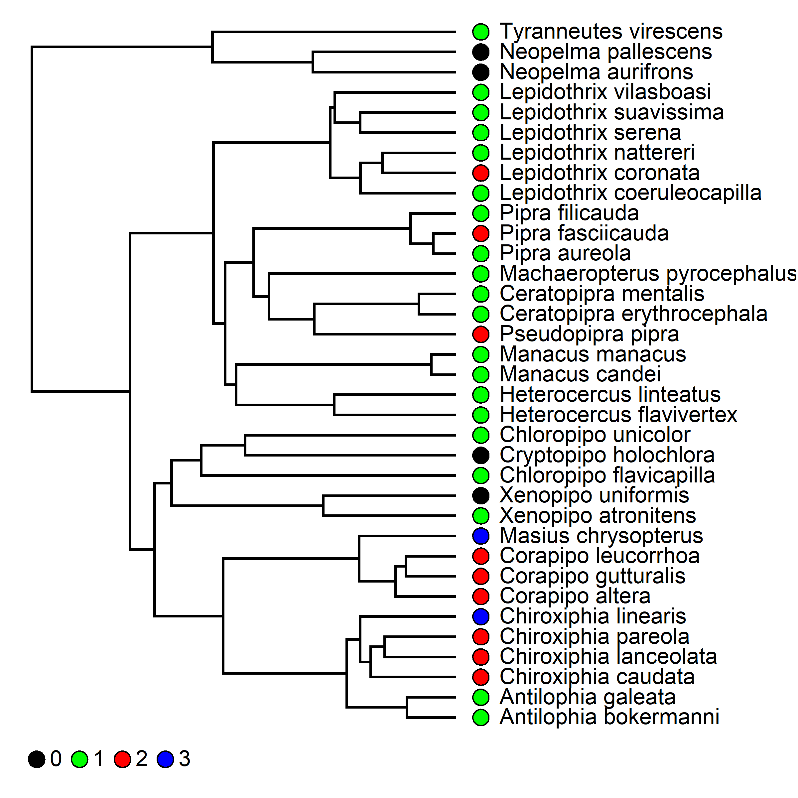

Delayed Plumage Maturation Evolution in Manakins (Aves: Pipridae)
================
Liam U. Taylor

\[Note: All data wrangling, analyses, and this README are produced by
the fully-automated RMarkdown file located in the base directory of this
repository (`finalproject.rmd`). Knit that file to reproduce this one.\]

# Introduction and Goals

Organisms with deferred reproduction trade the opportunity of current
reproduction for the opportunity of development while young
\[@stearns1992\]. In birds with delayed plumage maturation (DPM), this
youthful period of reproductive delay is accompanied by a drab
“predefinitive” plumage during the periods when older individuals are
molting into the colorful “definitive” plumages that characterize
increased reproductive effort and success. Research on DPM has largely
focused on functional hypotheses for the evolution of predefinitive
plumage signals (i.e., three hypotheses on why it is “good to be
green”). For example, the “crypsis” hypothesis suggests that drab
predefinitive plumages help young males avoid predators \[@selander1965;
@rohwer1978\] while the “social signalling” hypothesis suggests that
predefinitive plumages allow young males to reduce the likelihood or
costs of predation by signalling reduced reproductive capabilities
\[@selander1965; @lyon1986\]. Studies on these function predefinitive
hypotheses are limited on two fronts. First, direct benefits to
instantaneous survival rate are insufficient for positive selection on
the evolution of deferred reproduction, and are thus insufficient for
positive selection on the “delayed maturation” part of “delayed plumage
maturation” (Taylor in prep.).

Second, very little research has taken a phylogenetic view of DPM
evolution. There are only two such studies. The first phylogenetic
paper, by Chu \[-@chu1994\], found evidence that the evolution
predefinitive plumages in various shorebird taxa (Aves: Charadriiformes)
was the result of the evolution of juvenile plumage and the retention of
an ancestral partial molt. The result is that these shorebirds retain
part of their juvenile plumage in their first breeding season. This
study suggests that the evolution of DPM was the result of selection on
and constraints in molt timing, as opposed to selection on predefinitive
plumage patches. The second phylogenetic paper, by Hill \[-@hill1996\],
found that the presence of DPM in *Haemorhous* finches is associated
with a reduction in plumage patch size. This study recommends that
reduced plumage patches in these finches are themselves associated with
limits in carotenoid availability, and thus that the evolution of DPM is
associated with an increase in the resource costs of plumage coloration.
Unlike the (conceptually limited) functional hypotheses for the
evolution of predefinitive plumage signals, phylogenetic investigations
have supported constraint-based hypotheses for the evolution of
predefinitive plumages in association with developmental shifts.

Manakins (Aves:Passeriformes:Pipridae) are neotropical lekking birds
known for their extravagant male plumages and gymnastic sexual displays
\[@kirwan2011\]. Manakin species also vary widely in both the presence
and duration of DPM \[@kirwan2011; @ryder2019\]. Most research into
manakin predefinitive plumages has focused on the social signalling
hypotheses, and ecological and behavioral results from some species
indicates that DPM may play a role in cooperative interactions as young
males engage in social and sexual behavior with older individuals
\[e.g., @mcdonald1993\]. To date, there is no phylogenetic investigation
of manakin DPM which broadens these taxon-specific studies. Further, the
phylogenetic results of Chu \[-@chu1994\] and Hill \[-@hill1996\] cannot
apply to manakins. Unlike molt-constrainted shorebirds, manakins with
multiple predefinitive plumage stages have complete molts between
plumages. Unlike carotenoid-restricted finches, manakins are frugivorous
birds in the tropics that have ready access to food resources
\[@snow1971\].

Thus, we have neither a family-wide view of DPM in manakins, nor an
evolutionary hypothesis which can sustain one. My goal for this project
is to correct this gap. For the purposes of this class, I have three
explicit sub-goals: (1) Investigate the phylogenetic distribution of the
presence and duration of DPM in manakins, including estimating ancestral
states; (2) Identify predefinitive plumage homologs across taxa (i.e.,
which predefinitive plumage patches are present in the ancestral DPM
stage nodes); (3) Perform comparative tests of the association between
social characters and DPM evolution. The first two of these goals will
hopefully open doors to additional analyses about sexual selection and
discrete developmental processes in a phylogenetic context, while the
third goal will directly address the standing social signalling
hypotheses about DPM evolution in manakins.

# Methods and Results

## Character Coding

I used a combination of literature reports, field guides, banding
records, and photographs to code the number of DPM stages for each of 35
taxa and the distinct plumage patches at those stages. All taxa had 0,
1, 2, or 3 DPM stages, where a stage indicates an annual basic molt
cycle that begins with the partial molt out of juvenal plumage
\[@wolfe2014\]. A taxon with a DPM stage character state of 2 will
generally have be in its definitive plumage only at its 4th breeding
season (including its natal season), and so on. Unique partial or
enduring molts that result in characteristic plumage substages (e.g.,
*Chiroxiphia caudata*) were collapsed into these broader annual stages.
Taxa and citations are as follows:

| Taxon                         | Citations                                   |
| ----------------------------- | ------------------------------------------- |
| *Antilophia bokermanni*       | \[@azevedo1999; @kirwan2011; @gaiotti2016\] |
| *Antilophia galeata*          | \[@allen1893; @marini1992; @kirwan2011      |
| *Ceratopipra erythrocephala*  | \[@johnson2018\]                            |
| *Ceratopipra mentalis*        | \[@wolfe2009; @kirwan2011; @johnson2018\]   |
| *Chiroxiphia caudata*         | \[@mallet2012\]                             |
| *Chiroxiphia lanceolata*      | \[@duval2005\]                              |
| *Chiroxiphia linearis*        | \[@doucet2007\]                             |
| *Chiroxiphia pareola*         | \[@cardenas2018\]                           |
| *Chloropipo flavicapilla*     | \[@hellmayr1926; @kirwan2011\]              |
| *Chloropipo unicolor*         | \[@kirwan2011\]                             |
| *Corapipo altera*             | \[@jones2014\]                              |
| *Corapipo gutturalis*         | \[@prum1986; @johnson2018; @aramuni2019\]   |
| *Corapipo leucorrhoa*         | \[@rosselli1994\]                           |
| *Cryptopipo holochlora*       | \[@wetmore1972\]                            |
| *Heterocercus flavivertex*    | \[@prum1996; @kirwan2011\]                  |
| *Heterocercus linteatus*      | \[@kirwan2011\]                             |
| *Lepidothrix coeruleocapilla* | \[@kirwan2011\]                             |
| *Lepidothrix coronata*        | \[@ryder2005; @kirwan2011\]                 |
| *Lepidothrix serena*          | \[@prum1985; @snow2020\]                    |
| *Lepidothrix suavissima*      | \[@hilty2003; @snow2020\]                   |
| *Lepidothrix vilasboasi*      | \[@kirwan2011\]                             |
| *Lepidothrix nattereri*       | \[@kirwan2011; @snow2020\]                  |
| *Machaeropterus pyrocephalus* | \[@hilty2003; @kirwan2011\]                 |
| *Manacus candei*              | \[@wolfe2009\]                              |
| *Manacus manacus*             | \[@johnson2018; @tu2020\]                   |
| *Masius chrysopterus*         | \[@taylor2020\]                             |
| *Neopelma aurifrons*          | \[@kirwan2011\]                             |
| *Neopelma pallescens*         | \[@kirwan2011\]                             |
| *Pipra aureola*               | \[@kirwan2011\]                             |
| *Pipra fasciicauda*           | \[@robbins1985; @kirwan2011\]               |
| *Pipra filicauda*             | \[@ryder2005; @kirwan2011\]                 |
| *Pseudopipra pipra*           | \[@johnson2018\]                            |
| *Tyranneutes virescens*       | \[@johnson2018\]                            |
| *Xenopipo atronitens*         | \[@kirwan2011\]                             |
| *Xenopipo uniformis*          | \[@snow2020\]                               |

I used the data from Prum \[-@1994\] to code two binary social
characters: concentrated lekking and coordinated displays. Taxa with a 0
score for concentrated lekking included both dispersed and non-lekking
states, and taxa with a 1 score for coordinated displays included all of
simple, coordinated, and cooperative male-male display behaviors. I
supplemented some missing taxa with updated scores based on new
literature reports, but most missing data is still unavailable.

``` r
# A function to convert binary characters into probability distributions,
#   so that we can map missing data (NA) to a 50/50 probability across two columns
probMap <- function(v) {
  if (is.na(v)) {
    return(0.5)
  } 
  return(v)
}

# Read in the raw data matrix, concatenate taxa names,
#   convert multistate stages to binaries for correlation tests,
#   and convert unknown social states to uniform priors across two columns
stagesData <- read_csv(STAGES_FILE) %>%
          unite(Taxon, Genus, Species, sep="_") %>%
          mutate(S1Binary = as.numeric(Stages>0),
                 S2Binary = as.numeric(Stages>1),
                 S3Binary = as.numeric(Stages>2),
                 Coordinated_Present = map_dbl(Coordinated, probMap),
                 Coordinated_Absent = 1 - Coordinated_Present,
                 Concentrated_Present = map_dbl(Concentrated, probMap),
                 Concentrated_Absent = 1 - Concentrated_Present)
```

    ## Parsed with column specification:
    ## cols(
    ##   Genus = col_character(),
    ##   Species = col_character(),
    ##   Stages = col_double(),
    ##   Dichromatism = col_double(),
    ##   Coordinated = col_double(),
    ##   Concentrated = col_double()
    ## )

I coded predefinitive patches based on non-female- and non-juvenile-like
plumage patches at each DPM stage. It is necessary to code these patches
as broad visual units, rather than standardized morphological
components, because patches are metamodules which are the result of
covariation across barbs and barbules within and across both feathers
and feather tracts \[@prum2003\]. Although I initially coded patches
based on broad coloration method (“Carotenoid”, “Melanin”,
“Structural”), the analyses here collapse all coloaration methods
down to a binary “Present” (v. “Absent”) state. Some taxa (e.g.,
*Corapipo* manakins at stage 1) have an all female-like predefinitive
plumage stage, which corresponds to a “Absent” score for all taxa. Each
taxon has an individual plumage datasheet (see .csv files in
`finalproject.rmd`), which are aligned across all taxa with
post-alignment missing data correctly as “Absent”.

``` r
# A function to parse an individual plumage record into a matrix
extractPlumageFile <- function(file) {
  taxon <- strsplit(file, "\\.")[[1]][1]

  plumage <- read_csv(paste(PLUMAGE_DIR, file, sep=""),
                        col_types = cols(.default = col_character()))

  if (nrow(plumage) == 0) {
    plumage <- bind_rows(plumage, tibble(Character="Crown", S1="Absent"))
  }
  
  plumage <- plumage %>%
          pivot_longer(-Character, 
                       names_to="Stage",
                       values_to="Value") %>%
          unite(CharacterStage, Character, Stage, sep="_") %>%
          arrange(CharacterStage) %>%
          pivot_wider(names_from=CharacterStage, 
                      values_from=Value) %>%
          purrr::map(~ PLUMAGE_STATE_CODES[.]) %>%
          as.list() %>%
          as_tibble() %>%
          mutate(Taxon=taxon, .before=1)
  
  return(plumage)
}


# Construct the plumage character matrix
plumagesData <- list.files(PLUMAGE_DIR) %>%
             purrr::map_df(extractPlumageFile)

# All patches not indicated in the original plumage tables are absent
plumagesData[is.na(plumagesData)] <- 0
```

## Backbone Phylogeny

I use a the backbone phylogeny from [BirdTree](http://birdtree.org/)
\[@jetz2012\]. This is “supermatrix” tree which combines available
genetic data with standing taxonomic information. In my case, the use of
old taxonomic information results for some key edges (e.g., the
placement of *Xenopipo*, *Cryptopipo*, and *Pseudopipra*). A new tree
with UCE and exon genetic data from all species of manakins is in press
\[@leite2020\] and will be used for this project if the results are made
available in time for submission.

I requested a trace of 10,000 subtrees from BirdTree which were
generated with the all available tips in the family Pipridae. I used
[TreeAnnotator](https://beast.community/treeannotator) to collapse that
tree trace into a single consensus tree for analysis here. I then prune
the tree to retain only those tips for which DPM stage and predefinitive
plumage characters are available.

``` r
# Read the tree file
tree <- read.nexus(TREE_FILE)

# Refactor old taxon names which are common mislabeled across trees
refactorNames <- read_csv("Data/taxon_refactoring_names.csv")
```

    ## Parsed with column specification:
    ## cols(
    ##   Taxon_Old = col_character(),
    ##   Taxon_New = col_character()
    ## )

``` r
# A function to conditionally refactor a taxon 
refactorTaxon <- function(old) {
  if (old %in% refactorNames$Taxon_Old) {
    new <- refactorNames %>%
        filter(Taxon_Old == old) %>%
        pull(Taxon_New)
    return(new)
  }
  return(old)
}
refactoredTips <- map_chr(tree$tip.label, refactorTaxon)
tree$tip.label <- refactoredTips

# Determine tips which are in the tree but not the data

treeTips <- tree$tip.label

missingTips_stages <- treeTips[!(treeTips %in% stagesData$Taxon)]
missingTips_plumages <- treeTips[!(treeTips %in% plumagesData$Taxon)]

if (length(setdiff(missingTips_stages, missingTips_plumages)) != 0) {
  stop(paste("You do not have the same tip data available for stage and plumage patches\n",
             "Here are the different tips:\n",
             paste(setdiff(treeTips_stages, treeTips_plumages), collapse="  ")))
}

treePruned <- drop.tip(tree, missingTips_stages)
```

The plot below shows the pruned backbone tree. Tip labels indicate DPM
stage character states for each taxon.


## DPM Stages: Model Selection

I used a maximum-likelihood + information-theoretic approach to
evolutionary model selection for the DPM stage character. This
multi-state discrete character can be modeled with a 4-state Mk model
\[@pagel1994\]. Character frequencies are set as equal for all models.
Because this character happens to have four states within Pipridae, the
resulting models resemble genetic sequence evolution models even more
closely than normal.

I tested five models:

1.  Equal rates unordered | | 0 | 1 | 2 | 3 | | 0 | - | A | A | A | | 1
    | A | - | A | A | | 2 | A | A | - | A | | 3 | A | A | A | - |

2.  Equal rates ordered

  | 0 | 1 | 2 | 3 |  
0 | - | A | 0 | 0 |  
1 | A | - | A | 0 |  
2 | 0 | A | - | A |  
3 | 0 | 0 | A | - |

3.  Equal asymmetric rates ordered

  | 0 | 1 | 2 | 3 |  
0 | - | A | 0 | 0 |  
1 | B | - | A | 0 |  
2 | 0 | B | - | A |  
3 | 0 | 0 | B | - |

4.  Unequal symmetric rates ordered

  | 0 | 1 | 2 | 3 |  
0 | - | A | 0 | 0 |  
1 | A | - | B | 0 |  
2 | 0 | B | - | C |  
3 | 0 | 0 | C | - |

5.  Unequal asymmetric rates ordered

  | 0 | 1 | 2 | 3 |  
0 | - | A | 0 | 0 |  
1 | B | - | C | 0 |  
2 | 0 | D | - | E |  
3 | 0 | 0 | F | - |

Note that some of these models might have implications for the broader
connection between DPM evolution and perspectives such as sexual
selection theory. For example, the “equal asymmetric rates ordered”
model would allow for the evolutionary rate of stage gains to outweight
the rate of stage losses – this ratcheting of a sexual character might
be expected from e.g., Fisher’s runaway process \[@fisher1930\].

The transition rates which maximize the likelihood of the data were
estimated with the `fitMk` method in phytools \[@revell2011\]. The table
below shows AIC scores for each model. The preferred model, which
minimizes AIC, was the

And here are the transition rates which maximize the likelihood of the
DPM stage data given our chosen model constraints:

``` r
fitQ <- as.Qmatrix(fit_eq_sym_ordered)
fitQ
```

    ## Estimated Q matrix:
    ##             0           1           2           3
    ## 0 -0.03321366  0.03321366  0.00000000  0.00000000
    ## 1  0.03321366 -0.06642732  0.03321366  0.00000000
    ## 2  0.00000000  0.03321366 -0.06642732  0.03321366
    ## 3  0.00000000  0.00000000  0.03321366 -0.03321366

## DPM Stages: Ancestral State Estimation

Now that we have established the structure of our underlying
evolutionary model, I can estimate the probability DPM plumage character
for internal nodes in the manakin phylogeny. Here I do this ancestral
state estimation by simulating stochastic character maps along the tree
under our equal symmetric ordered evolutionary model. I use the
`make.sim` function from phytools to simulate 1000 maps. The summary of
those maps is shown below. Taxon tips are assigned to their input data
state and internal nodes are colored by the proportion of simulations in
a given state. Ticks along each edge indicate simulated transitions
across all simulations.


In particular, note two key internal nodes:

1.  The parent node of the core manakins (i.e., the clade excluding the
    tyrant-manakins, *Tyranneutes* and *Neopelma*) has a high
    probability of 1-Stage DPM (probability = 0.98).
2.  The parent node of the Ilicurini subclade (i.e., the clade including
    *Masius*, *Corapipo*, *Chiroxiphia*, and *Antilophia*) has a
    majority probability of 2-Stage DPM (probability = 0.601).

I can also summarize the estimated stage transitions as the mean count
of transitions across all simulations:

    ##       0     1     2     3
    ## 0    NA 1.625 0.000 0.000
    ## 1 3.356    NA 4.931 0.000
    ## 2 0.000 1.513    NA 2.061
    ## 3 0.000 0.000 0.135    NA

Despite gains and losses being governed by the same rate parameter
across all states, there are on average more gains than losses (8.617
gains vs.  5.004 losses).

The most frequent transition is from stage 1 to stage 2.

## Plumage Patches: Homologies within Stages

Now that I have identified ancestral DPM plumage stages across the tree,
I can take a closer look at plumage patch characters within each stage
and determine whether there are homologies plumage patches across taxa.
In this case, I can interpret homologous patches as those that estimated
to be present in the ancestral nodes which also have an ancestral state
for a given DPM stage. First, I can use stochastic maps to simulate the
evolution of each patch for each stage as a separate binary character. I
again use the `make.simmap` function to simulate the evolution of each
plumage character (100 simulations per character). Each character is
simulated under a separate evolutionary model in which gain and loss of
the patch can have different rates (i.e., “all rates different” for a
binary character). The transition rate matrix is estimated within the
`make.simmap` function as the model which maximizes the likelihood of
the data for the given character.

First, we can view the results across all of the patches. The figures
below show the simulation results for each character. Because there are
now binary characters, we can view the probability density, across all
simulations, for the presence of the character along every edge. Red
indicates high probability of presence of a patch, blue indicates low
probability.

Correlated evolution

    ## Warning in kable_styling(kable_input, "none", htmltable_class = light_class, :
    ## Please specify format in kable. kableExtra can customize either HTML or LaTeX
    ## outputs. See https://haozhu233.github.io/kableExtra/ for details.

| Social       | Stage |    p | AIC\_ind | AIC\_dep |   dAIC | Dependency |
| :----------- | :---- | ---: | -------: | -------: | -----: | :--------- |
| Concentrated | S1    | 0.36 |    67.17 |    69.12 |   1.94 | X\<-\>Y    |
| Concentrated | S2    | 0.64 |    83.77 |    86.87 |   3.10 | X\<-\>Y    |
| Concentrated | S3    | 0.74 |    64.41 |    67.82 |   3.41 | X\<-\>Y    |
| Coordinated  | S1    | 0.11 |    65.95 |    65.60 | \-0.35 | X\<-\>Y    |
| Coordinated  | S2    | 0.05 |    82.55 |    80.47 | \-2.08 | X\<-\>Y    |
| Coordinated  | S3    | 0.07 |    63.19 |    61.97 | \-1.22 | X\<-\>Y    |

    ## Warning in kable_styling(kable_input, "none", htmltable_class = light_class, :
    ## Please specify format in kable. kableExtra can customize either HTML or LaTeX
    ## outputs. See https://haozhu233.github.io/kableExtra/ for details.

| Social      | Stage |    p | AIC\_ind | AIC\_dep |   dAIC | Dependency |
| :---------- | :---- | ---: | -------: | -------: | -----: | :--------- |
| Coordinated | S2    | 0.02 |    82.55 |    78.65 | \-3.89 | X\<-Y      |
| Coordinated | S3    | 0.03 |    63.19 |    60.25 | \-2.94 | X\<-Y      |

# Discussion and Conclusion

# References
