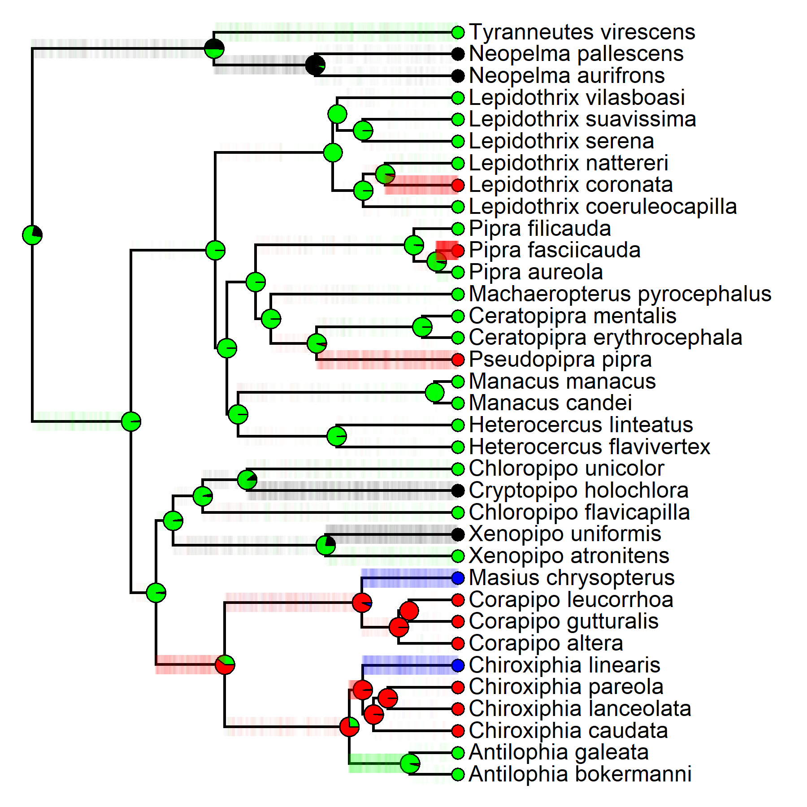
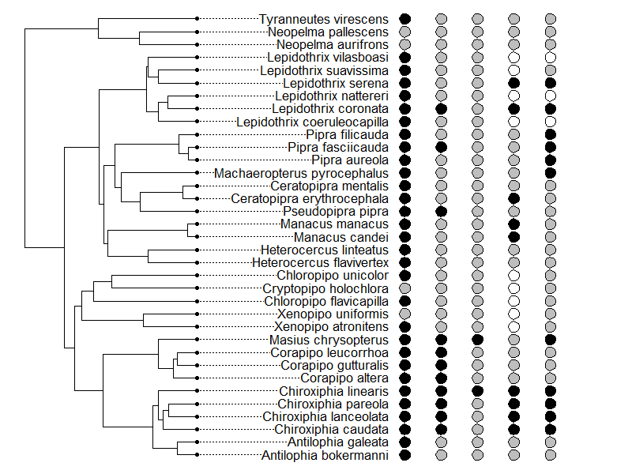

Delayed Plumage Maturation Evolution in Manakins (Aves: Pipridae)
================
Liam U. Taylor

NOTE: All data wrangling and analyses fully automated in the RMarkdown
file located in the base directory of this repository
(`finalproject.rmd`). Knit that file to reproduce this one.

# Introduction and Goals

Organisms with deferred reproduction forgo the production of offspring
for the opportunities of development while young (Stearns 1992). In
birds with delayed plumage maturation (DPM), this youthful period of
reproductive delay is accompanied by a drab “predefinitive” plumage
during the periods when older individuals are molting into the colorful
“definitive” plumages that characterize increased reproductive effort
and success. Research on DPM has largely focused on functional
hypotheses for the evolution of predefinitive plumage signals (i.e.,
hypotheses on why it is “good to be green”). For example, the “crypsis”
hypothesis suggests that drab predefinitive plumages help young males
avoid predators (Selander 1965; Rohwer 1978) while the “social
signalling” hypothesis suggests that predefinitive plumages allow young
males to reduce the likelihood or costs of competition by signalling
reduced reproductive capabilities (Selander 1965; Lyon and Montgomerie
1986). Studies of these functional hypotheses are limited on two fronts.
First, direct benefits to instantaneous survival rate are insufficient
for positive selection on the evolution of deferred reproduction, and
are thus insufficient for positive selection on the “delayed maturation”
part of “delayed plumage maturation” (Taylor in prep.).

Second, very little research has taken a phylogenetic view of DPM
evolution. There are only two such studies. The first phylogenetic
paper, by Chu (1994), found evidence that the evolution of predefinitive
plumages in various shorebird taxa (Aves: Charadriiformes) was the
result of the evolution of *juvenile* plumage in combination with
retained partial molts. The result is that these shorebirds retain part
of their juvenile plumage in their first breeding season. This study
suggests that the evolution of DPM was the result of selection on
juvenile plumages and constraints in molt timing, as opposed to
selection on predefinitive plumages themselves. The second phylogenetic
paper, by Hill (1996), found that the presence of DPM in *Haemorhous*
finches is associated with a reduction in plumage patch size across
species. This study recommends that reduced plumage patches are
themselves associated with limits in carotenoid availability, and thus
that the evolution of DPM is associated with an increase in the resource
costs of plumage coloration. In opposition to functional hypotheses for
the evolution of predefinitive plumage signals, phylogenetic
investigations have supported constraint-based hypotheses for DPM
evolution.

Manakins (Aves: Passeriformes: Pipridae) are neotropical lekking birds
known for their extravagant male plumages and gymnastic sexual displays
(Kirwan, Green, and Barnes 2011). Manakin species also vary widely in
both the presence and duration of DPM (Kirwan, Green, and Barnes 2011;
Johnson and Wolfe 2017). Most research into manakin predefinitive
plumages has focused on the social signalling hypothesis, and ecological
and behavioral results from some species indicates that DPM may play a
role in cooperative interactions as young males engage in social and
sexual behavior with older individuals (e.g., McDonald 1993). To date,
there is no phylogenetic investigation of manakin DPM which broadens
these taxon-specific studies. Further, the phylogenetic conclusions of
Chu (1994) and Hill (1996) cannot be applied to manakins. Unlike
molt-constrained shorebirds, manakins with multiple predefinitive
plumage stages have complete molts between plumages. Unlike
carotenoid-restricted finches, manakins are frugivorous birds in the
tropics that have ready access to food resources (Snow 1971).

Thus, we have neither a family-wide view of DPM in manakins nor an
evolutionary hypothesis which can underpin such a view. My goal for this
project is to correct this gap. For the purposes of this class, I have
three explicit sub-goals: (1) Investigate the phylogenetic distribution
of the presence and duration of DPM in manakins, including estimating
ancestral states; (2) Identify predefinitive plumage homologs across
taxa; and (3) Perform comparative tests of the association between
social characters and DPM evolution. The first two goals will hopefully
open doors to additional analyses about sexual selection and discrete
developmental processes in a phylogenetic context, while the third goal
will directly address the standing social signalling hypotheses about
DPM evolution in manakins.

# Methods and Results

## Character Coding

I used a combination of literature reports, field guides, banding
records, and photographs to code the number of DPM stages for each of 35
taxa along with the distinct (non-green) plumage patches at those
stages. All taxa had 0, 1, 2, or 3 DPM stages, where a stage indicates
an annual basic molt cycle that begins with the partial molt out of
juvenal plumage (Wolfe, Johnson, and Terrill 2014). For example: a taxon
with a DPM stage state of 2 will be in its definitive plumage only at
its 4th breeding season (including its natal season). Unique partial
molts that result in characteristic plumage substages (e.g.,
*Chiroxiphia caudata*) were collapsed into these broader annual stages.
Taxa and citations are as follows:

| Taxon                         | Citations                                                                                       |
| ----------------------------- | ----------------------------------------------------------------------------------------------- |
| *Antilophia bokermanni*       | (Azevedo-Júnior, Nascimento, and Nascimento 2000; Kirwan, Green, and Barnes 2011; Gaiotti 2016) |
| *Antilophia galeata*          | (Marini and Cavalcanti 1992; Kirwan, Green, and Barnes 2011)                                    |
| *Ceratopipra erythrocephala*  | (Johnson and Wolfe 2017)                                                                        |
| *Ceratopipra mentalis*        | (Wolfe, Pyle, and Ralph 2009; Kirwan, Green, and Barnes 2011; Johnson and Wolfe 2017)           |
| *Chiroxiphia caudata*         | (Mallet-Rodrigues and Dutra 2012)                                                               |
| *Chiroxiphia lanceolata*      | (DuVal 2005)                                                                                    |
| *Chiroxiphia linearis*        | (Doucet et al. 2007)                                                                            |
| *Chiroxiphia pareola*         | (Cárdenas‐Posada et al. 2018)                                                                   |
| *Chloropipo flavicapilla*     | (Kirwan, Green, and Barnes 2011)                                                                |
| *Chloropipo unicolor*         | (Kirwan, Green, and Barnes 2011)                                                                |
| *Corapipo altera*             | (Jones, DuVal, and Boyle 2014)                                                                  |
| *Corapipo gutturalis*         | (Prum 1985; Johnson and Wolfe 2017; Aramuni 2019)                                               |
| *Corapipo leucorrhoa*         | (Rosselli 1994)                                                                                 |
| *Cryptopipo holochlora*       | (Wetmore 1972)                                                                                  |
| *Heterocercus flavivertex*    | (Prum, Kaplan, and Pierson 1996; Kirwan, Green, and Barnes 2011)                                |
| *Heterocercus linteatus*      | (Kirwan, Green, and Barnes 2011)                                                                |
| *Lepidothrix coeruleocapilla* | (Kirwan, Green, and Barnes 2011)                                                                |
| *Lepidothrix coronata*        | (Ryder and Durães 2005; Kirwan, Green, and Barnes 2011)                                         |
| *Lepidothrix serena*          | \[Prum (1985); BotW\]                                                                           |
| *Lepidothrix suavissima*      | \[Hilty (2003); BotW\]                                                                          |
| *Lepidothrix vilasboasi*      | (Kirwan, Green, and Barnes 2011)                                                                |
| *Lepidothrix nattereri*       | \[Kirwan, Green, and Barnes (2011); BotW\]                                                      |
| *Machaeropterus pyrocephalus* | (Hilty 2003; Kirwan, Green, and Barnes 2011)                                                    |
| *Manacus candei*              | (Wolfe, Pyle, and Ralph 2009)                                                                   |
| *Manacus manacus*             | (Johnson and Wolfe 2017)                                                                        |
| *Masius chrysopterus*         | (BotW)                                                                                          |
| *Neopelma aurifrons*          | (Kirwan, Green, and Barnes 2011)                                                                |
| *Neopelma pallescens*         | (Kirwan, Green, and Barnes 2011)                                                                |
| *Pipra aureola*               | (Kirwan, Green, and Barnes 2011)                                                                |
| *Pipra fasciicauda*           | (Robbins 1985; Kirwan, Green, and Barnes 2011)                                                  |
| *Pipra filicauda*             | (Ryder and Durães 2005; Kirwan, Green, and Barnes 2011)                                         |
| *Pseudopipra pipra*           | (Johnson and Wolfe 2017)                                                                        |
| *Tyranneutes virescens*       | (Johnson and Wolfe 2017)                                                                        |
| *Xenopipo atronitens*         | (Kirwan, Green, and Barnes 2011)                                                                |
| *Xenopipo uniformis*          | (BotW)                                                                                          |

I used the data from Prum (1994) to code two binary social characters:
concentrated lekking and coordinated displays. Taxa with a 0 score for
concentrated lekking included both dispersed and non-lekking states, and
taxa with a 1 score for coordinated displays included all of simple,
coordinated, and cooperative male-male display behaviors. I supplemented
some missing taxa with updated scores based on new literature reports,
but most missing data is still unavailable.

I coded predefinitive plumages with non-female- and non-juvenile-like
plumage patches at each DPM stage. It is necessary to code these patches
as broad visual units, rather than standardized morphological
components, because patches are metamodules that result from covariation
across barbs and barbules within and across both feathers and feather
tracts (Prum and Dyck 2003). Although I initially coded patches based on
broad coloration method (“Carotenoid”, “Melanin”, “Structural”), the
analyses here collapse all coloration methods down to a binary
“Present”=1 *vs.* “Absent”=0 state. Some taxa (e.g., *Corapipo*
manakins at Stage 1) have a fully female-like predefinitive plumage
stage which corresponds to a “Absent” score for all patches. Each taxon
is associated with an individual plumage datasheet (see .csv files in
the `Data` directory). These sheets are then aligned across taxa with
missing data marked correctly as “Absent.”

## Backbone Phylogeny

I use a backbone phylogeny from [BirdTree](http://birdtree.org/) (Jetz
et al. 2012). This tree combines publicly available genetic data with
standing taxonomic information. In my case, the use of old taxonomic
information results in some important erroneous splits (e.g., the
placement of *Xenopipo*, *Cryptopipo*, and *Pseudopipra*), but for the
purposes of this project I have taken the tree as-is.

I imported a trace of 10,000 subtrees from BirdTree which were generated
with all available Pipridae taxa. I used
[TreeAnnotator](https://beast.community/treeannotator) to collapse that
trace into a single consensus tree for all analyses. I then prune the
tree to retain only those tips for which DPM stage and predefinitive
plumage characters are available.

The plot below shows the pruned backbone tree. Tip labels indicate DPM
stages for each taxon. 

## DPM Stages: Model Selection

I used a maximum-likelihood + information-theoretic approach to DPM
stage evolutionary model selection. This multi-state discrete character
can be modeled with a 4-state Mk model (Pagel 1994). Prior state
frequencies are equal for all models. Because this character happens to
have four states within Pipridae, the resulting models resemble genetic
models even more closely than usual.

I tested five models:

1.  Equal rates unordered

<!-- end list -->

    ##   0 1 2 3
    ## 0 - A A A
    ## 1 A - A A
    ## 2 A A - A
    ## 3 A A A -

2.  Equal rates ordered

<!-- end list -->

    ##   0 1 2 3
    ## 0 - A 0 0
    ## 1 A - A 0
    ## 2 0 A - A
    ## 3 0 0 A -

3.  Equal asymmetric rates ordered

<!-- end list -->

    ##   0 1 2 3
    ## 0 - A 0 0
    ## 1 B - A 0
    ## 2 0 B - A
    ## 3 0 0 B -

4.  Unequal symmetric rates ordered

<!-- end list -->

    ##   0 1 2 3
    ## 0 - A 0 0
    ## 1 A - B 0
    ## 2 0 B - C
    ## 3 0 0 C -

5.  Unequal asymmetric rates ordered

<!-- end list -->

    ##   0 1 2 3
    ## 0 - A 0 0
    ## 1 B - C 0
    ## 2 0 D - E
    ## 3 0 0 F -

Note that some of these models might have implications for the broader
connection between DPM evolution and e.g., sexual selection theory. For
example, the “Equal Asymmetric Ordered” model would allow for the rate
of stage gains to outweigh the rate of stage losses – this ratcheting of
a sexual character might be expected from e.g., Fisher’s runaway process
(Fisher 1930).

The transition rates which maximize the likelihood of the data were
estimated with the `fitMk` method in phytools (Revell 2012). The table
below shows AIC scores for each model. The preferred model, which
minimizes AIC, was the Equal Symmetric Ordered Model.

<table class=" lightable-classic" style="font-size: 20px; font-family: Arial; width: auto !important; margin-left: auto; margin-right: auto;">

<thead>

<tr>

<th style="text-align:left;">

Model

</th>

<th style="text-align:right;">

AIC

</th>

<th style="text-align:right;">

dAIC

</th>

</tr>

</thead>

<tbody>

<tr>

<td style="text-align:left;">

Equal Rates Unordered

</td>

<td style="text-align:right;">

77.31

</td>

<td style="text-align:right;">

7.84

</td>

</tr>

<tr>

<td style="text-align:left;font-weight: bold;background-color: #D6EED4 !important;">

Equal Symmetric Ordered

</td>

<td style="text-align:right;font-weight: bold;background-color: #D6EED4 !important;">

69.47

</td>

<td style="text-align:right;font-weight: bold;background-color: #D6EED4 !important;">

0.00

</td>

</tr>

<tr>

<td style="text-align:left;">

Equal Asymmetric Ordered

</td>

<td style="text-align:right;">

71.14

</td>

<td style="text-align:right;">

1.67

</td>

</tr>

<tr>

<td style="text-align:left;">

Unequal Symmetric Ordered

</td>

<td style="text-align:right;">

72.59

</td>

<td style="text-align:right;">

3.12

</td>

</tr>

<tr>

<td style="text-align:left;">

Unequal Asymmetric Ordered

</td>

<td style="text-align:right;">

77.01

</td>

<td style="text-align:right;">

7.53

</td>

</tr>

</tbody>

</table>

And here are the transition rates which maximize the likelihood of DPM
stage data given our chosen model constraints:

    ## Estimated Q matrix:
    ##        0      1      2      3
    ## 0 -0.033  0.033  0.000  0.000
    ## 1  0.033 -0.066  0.033  0.000
    ## 2  0.000  0.033 -0.066  0.033
    ## 3  0.000  0.000  0.033 -0.033

## DPM Stages: Ancestral State Estimation

Now that I have established an underlying evolutionary model, I can
estimate the probability of DPM stages for internal nodes in the manakin
phylogeny. Here I do this ancestral state estimation by simulating
stochastic character evolution maps. I use the `make.simmap` function
from phytools to simulate 1000 maps. The summary of those maps is shown
below. Taxon tips are assigned to their input data state and internal
nodes are colored by the proportion of simulations in a given state.
Ticks along each edge indicate simulated transitions across all
simulations.

In particular, note two key internal nodes:

1.  The parent node of the core manakins (i.e., the clade excluding the
    tyrant-manakins, *Tyranneutes* and *Neopelma*) has a high
    probability of Stage 1 DPM (probability = 0.98).
2.  The parent node of the Ilicurini subclade (i.e., the clade including
    *Masius*, *Corapipo*, *Chiroxiphia*, and *Antilophia*) has a
    majority probability of Stage 2 DPM (probability = 0.6).

I can also summarize the estimated stage transitions as the mean count
of transitions across all simulations:

    ##       0     1     2     3
    ## 0    NA 1.625 0.000 0.000
    ## 1 3.356    NA 4.931 0.000
    ## 2 0.000 1.513    NA 2.061
    ## 3 0.000 0.000 0.135    NA

Despite gains and losses being governed by the same rate parameter
across all states, there are more gains than losses on average (8.617
gains vs. 5.004 losses).

The most frequent transition is from Stage 1 to Stage 2.

## Plumage Patches: Homologies within Stages

Now that I have identified ancestral DPM plumage stages across the tree,
I can take a closer look at plumage patch characters within each stage
and determine whether there are homologous plumages across taxa. In this
case, I can interpret homologous patches as those estimated to be
present in the ancestral nodes with DPM stages. First, I can use
stochastic maps to simulate the evolution of each patch at each stage as
a separate binary character. I again use the `make.simmap` function to
simulate the evolution of each plumage character (100 simulations per
character). Each character is simulated under separate All Rates
Different models.

I can first view the results across all patches. The figures below show
the simulation results for each character. Because these patches are now
binary characters, I can view the probability density, across all
simulations, for the presence of the character along every edge. Red
indicates high probability of presence of a patch, blue indicates low
probability.

Note the uncertain edges between the root node and its child nodes. Note
also that this model seems ill-equipped to parse the evolutionary
history of the Body\_S1 plumage patch, which is widely distributed
across the tips with many presumed gains and losses. The result is that
the state of this patch is highly variable across different stochastic
histories. Two further steps might make these simulations more
realistic: (1) incorporating information about coloration method (i.e.,
Absent vs. Carotenoid/Melanin/Structural rather than Absent vs. Present)
and (2) developing a model which is informed by all plumage patches
simultaneously.

In the meantime, I want to consider the two key internal nodes I derived
in the DPM stage ancestral state estimations: the Stage 1 ancestor of
the core manakin clade and the Stage 2 ancestor of the Ilicurini
subclade. What might those predefinitive plumages have looked like?

Here are the highest probability predefinitive plumage patches for the
core manakin ancestor:

<table class=" lightable-classic" style='font-size: 20px; font-family: "Arial Narrow", "Source Sans Pro", sans-serif; width: auto !important; margin-left: auto; margin-right: auto;'>

<thead>

<tr>

<th style="text-align:left;">

Character

</th>

<th style="text-align:right;">

Presence\_Prob

</th>

</tr>

</thead>

<tbody>

<tr>

<td style="text-align:left;">

Body\_S1

</td>

<td style="text-align:right;">

0.47

</td>

</tr>

<tr>

<td style="text-align:left;">

Crown\_S1

</td>

<td style="text-align:right;">

0.51

</td>

</tr>

</tbody>

</table>

And here are the highest probability patches for the Ilicurini ancestor:

<table class=" lightable-classic" style='font-size: 20px; font-family: "Arial Narrow", "Source Sans Pro", sans-serif; width: auto !important; margin-left: auto; margin-right: auto;'>

<thead>

<tr>

<th style="text-align:left;">

Character

</th>

<th style="text-align:right;">

Presence\_Prob

</th>

</tr>

</thead>

<tbody>

<tr>

<td style="text-align:left;">

Crown\_S1

</td>

<td style="text-align:right;">

0.48

</td>

</tr>

<tr>

<td style="text-align:left;">

Rectrices\_S2

</td>

<td style="text-align:right;">

0.48

</td>

</tr>

<tr>

<td style="text-align:left;">

Face\_S2

</td>

<td style="text-align:right;">

0.71

</td>

</tr>

</tbody>

</table>

In this version of the analysis (i.e., with binary characters and
separate models for each character), there are only two patches which
pass even a meager 50% threshold at the ancestral DPM stage nodes. This
has a reasonable biological interpretation for the core Stage 1
ancestor, which might be thought of as a “female-like” predefinitive
plumage without additional patches. On the other hand, there are no
female-like Stage 2 plumages in manakins. If I take the highest
probability patches for each of these stages as the description of
plumage, I get an ancestral core Stage 1 plumage with a crown patch, as
well as an ancestral Ilicurini Stage 2 plumage with a face patch (in
current taxa, usually a black mask). In general, this binary+separate
character analysis does not show strong support any particular
predefinitive plumage characters conserved across clades which share DPM
stage synapomorphies.

## Social Correlations

Finally, I want to address the hypothesis that the evolution of DPM is
associated with social and sexual behaviors in manakins. In a
phylogenetic context, I can extend this hypothesis to predict that there
is correlated coevolution between social characters and DPM stages. To
test this prediction, I can use Pagel’s phylogenetic correlation method
for binary, discrete characters (Pagel 1994). In particular, I will test
for two sets of coevolutionary dependencies: (1) coevolution between DPM
stages and concentrated lekking and (2) coevolution between DPM stages
and coordinated male-male displays. As described above, I have already
coded concentrated lekking and cooperative displays as binary
characters. I can also convert the discrete multi-state DPM stage
character to a set of binary characters. The result is three separate
characters for the Presence vs. Absence of Stage 1, Stage 2, and Stage
3, respectively, for each taxon.

The tree below shows all of these recoded characters. From left to
right, dots at the tips indicate the Presence (black), Absence (gray) or
missing data (white) state for: (1) Stage 1 DPM, (2) Stage 2; (3) Stage
3; (4) Concentrated Lekking; (5) Coordinated Displays. Note the missing
data in the social characters for some taxa. In the context of the Pagel
discrete coevolution assessment, characters with missing data can be
reinterpreted as prior probabilities of Presence or Absence. For taxa
with known codings, the prior probability of the assigned state is 1.
For taxa with missing data, the prior probability is 0.5 for both
states.

I can now test for signs of coevolution between each of the three
plumage stages and the two social characters. I use the `fitPagel`
method from phytools to compare the AIC scores for two models for each
pair of characters. One model asserts the independent evolution of the
two paired characters. The second, more parameter-rich model assumes a
dependency, where, for example, the transition from 0-\>1 in character X
depends on the state (0 or 1) of character Y. Support for coevolution is
associated with a lower AIC score for the dependent evolution model.
Here, I use separate equal rates model for each pair of characters.

The first step is to check for a sign of coevolution in general. I do
this by viewing the results of model comparison where dependency runs in
both ways. The table below shows the result (X = Stage Character, Y =
Social character). Negative values in the dAIC column indicate that the
dependent (i.e., coevolutionary) model was preferred to the independent
model.

<table class=" lightable-classic" style='font-size: 20px; font-family: "Arial Narrow", "Source Sans Pro", sans-serif; width: auto !important; margin-left: auto; margin-right: auto;'>

<thead>

<tr>

<th style="text-align:left;">

Social

</th>

<th style="text-align:left;">

Stage

</th>

<th style="text-align:right;">

p

</th>

<th style="text-align:right;">

AIC\_ind

</th>

<th style="text-align:right;">

AIC\_dep

</th>

<th style="text-align:right;">

dAIC

</th>

<th style="text-align:left;">

Dependency

</th>

</tr>

</thead>

<tbody>

<tr>

<td style="text-align:left;">

Concentrated

</td>

<td style="text-align:left;">

S1

</td>

<td style="text-align:right;">

0.36

</td>

<td style="text-align:right;">

67.17

</td>

<td style="text-align:right;">

69.12

</td>

<td style="text-align:right;">

1.94

</td>

<td style="text-align:left;">

X\<-\>Y

</td>

</tr>

<tr>

<td style="text-align:left;">

Concentrated

</td>

<td style="text-align:left;">

S2

</td>

<td style="text-align:right;">

0.64

</td>

<td style="text-align:right;">

83.77

</td>

<td style="text-align:right;">

86.87

</td>

<td style="text-align:right;">

3.10

</td>

<td style="text-align:left;">

X\<-\>Y

</td>

</tr>

<tr>

<td style="text-align:left;">

Concentrated

</td>

<td style="text-align:left;">

S3

</td>

<td style="text-align:right;">

0.74

</td>

<td style="text-align:right;">

64.41

</td>

<td style="text-align:right;">

67.82

</td>

<td style="text-align:right;">

3.41

</td>

<td style="text-align:left;">

X\<-\>Y

</td>

</tr>

<tr>

<td style="text-align:left;font-weight: bold;background-color: #D6EED4 !important;">

Coordinated

</td>

<td style="text-align:left;font-weight: bold;background-color: #D6EED4 !important;">

S1

</td>

<td style="text-align:right;font-weight: bold;background-color: #D6EED4 !important;">

0.11

</td>

<td style="text-align:right;font-weight: bold;background-color: #D6EED4 !important;">

65.95

</td>

<td style="text-align:right;font-weight: bold;background-color: #D6EED4 !important;">

65.60

</td>

<td style="text-align:right;font-weight: bold;background-color: #D6EED4 !important;">

\-0.35

</td>

<td style="text-align:left;font-weight: bold;background-color: #D6EED4 !important;">

X\<-\>Y

</td>

</tr>

<tr>

<td style="text-align:left;font-weight: bold;background-color: #D6EED4 !important;">

Coordinated

</td>

<td style="text-align:left;font-weight: bold;background-color: #D6EED4 !important;">

S2

</td>

<td style="text-align:right;font-weight: bold;background-color: #D6EED4 !important;">

0.05

</td>

<td style="text-align:right;font-weight: bold;background-color: #D6EED4 !important;">

82.55

</td>

<td style="text-align:right;font-weight: bold;background-color: #D6EED4 !important;">

80.47

</td>

<td style="text-align:right;font-weight: bold;background-color: #D6EED4 !important;">

\-2.08

</td>

<td style="text-align:left;font-weight: bold;background-color: #D6EED4 !important;">

X\<-\>Y

</td>

</tr>

<tr>

<td style="text-align:left;font-weight: bold;background-color: #D6EED4 !important;">

Coordinated

</td>

<td style="text-align:left;font-weight: bold;background-color: #D6EED4 !important;">

S3

</td>

<td style="text-align:right;font-weight: bold;background-color: #D6EED4 !important;">

0.07

</td>

<td style="text-align:right;font-weight: bold;background-color: #D6EED4 !important;">

63.19

</td>

<td style="text-align:right;font-weight: bold;background-color: #D6EED4 !important;">

61.97

</td>

<td style="text-align:right;font-weight: bold;background-color: #D6EED4 !important;">

\-1.22

</td>

<td style="text-align:left;font-weight: bold;background-color: #D6EED4 !important;">

X\<-\>Y

</td>

</tr>

</tbody>

</table>

Finally, I can dig a bit deeper and test for dependency directionality
in the character pairs which showed some support for coevolution. The
table below shows the results. I find some support for the evolutionary
association between coordinated display behavior and the presence of 2
or 3 DPM stages across the manakin tree. Recall, however, that there are
only two taxa with Stage 3 DPM.

<table class=" lightable-classic" style='font-size: 20px; font-family: "Arial Narrow", "Source Sans Pro", sans-serif; width: auto !important; margin-left: auto; margin-right: auto;'>

<thead>

<tr>

<th style="text-align:left;">

Social

</th>

<th style="text-align:left;">

Stage

</th>

<th style="text-align:right;">

p

</th>

<th style="text-align:right;">

AIC\_ind

</th>

<th style="text-align:right;">

AIC\_dep

</th>

<th style="text-align:right;">

dAIC

</th>

<th style="text-align:left;">

Dependency

</th>

</tr>

</thead>

<tbody>

<tr>

<td style="text-align:left;">

Coordinated

</td>

<td style="text-align:left;">

S2

</td>

<td style="text-align:right;">

0.02

</td>

<td style="text-align:right;">

82.55

</td>

<td style="text-align:right;">

78.65

</td>

<td style="text-align:right;">

\-3.89

</td>

<td style="text-align:left;">

X\<-Y

</td>

</tr>

<tr>

<td style="text-align:left;">

Coordinated

</td>

<td style="text-align:left;">

S3

</td>

<td style="text-align:right;">

0.03

</td>

<td style="text-align:right;">

63.19

</td>

<td style="text-align:right;">

60.25

</td>

<td style="text-align:right;">

\-2.94

</td>

<td style="text-align:left;">

X\<-Y

</td>

</tr>

</tbody>

</table>

# Discussion

## Key results

In this project, I initated a phylogenetic view of both deferred
reproduction and delayed plumage maturation by coding two sets of
characters: (1) the number of annual predefinitive plumage stages and
(2) the characteristic patches for individual predefinitive plumages.
Across 35 species that span all genera in the family Pipridae, I used
stochastic maps to identify an ancestral “Stage 1” DPM phenotype in the
ancestor of all core manakins (i.e., excluding *Tyranneutes* and
*Neopelma*), an ancestral “Stage 2” DPM phenotype for the ancestor of
the Ilicurini tribe, and losses in DPM stages on the edges leading to
the *Cryptopipo*, *Xenopipo*, and *Antilophia* species. With stochastic
maps of individual predefinitive plumage patches, I began the process of
reconstructing homologous predefinitive plumage qualities across
species. In particular, I identified a fully female-like plumage, or
female-like-with-crown plumage, in the Stage 1 ancestor of the core
manakins. I also supported the possibility of a mask patch in the Stage
2 ancestor of Ilicurini. In line with the social-signalling hypothesis
for individual manakin taxa, coevolutionary model testing supported the
hypothesis that Stage 2 DPM evolution is related to the presence of
coordinated male-male displays across taxa.

## Sexual selection in a phylogeny

Prum (1997) probed the manakin phylogeny for signals of macroevolution
via Fisherian sexual selection processes. The study focused on the rate
and skew of evolution of manakin definitive plumage and display
characters, finding high levels of diversity and hierarchical evolution
biased towards the tips. At several points in this project, I continue
to address the possibilities of registering a signal of evolution via
sexual selection (in contrast to telenomic natural selection; (Prum
2017)) on a phylogeny.

1.  Gains *vs.* losses in DPM stage evolution. In most manakins, the
    predefinitive plumage period is a time of sexual and social
    development. It is during these predefinitive stage(s) that young
    birds develop the abilities to display or learn the rules of the
    game in terms of access to sexual displays (McDonald 1993; and see
    Collis and Borgia 1993; Prum and Razafindratsita 1997). Thus, one
    possible signal of sexual selection is the acceleration of DPM
    stages driven by the accelearation of DPM characters. Put most
    simply, one might expect DPM stage gains to proceed at a faster rate
    than losses. Although my analysis did count more gains than losses
    along the Pipridae tree, AIC-based model comparison favored an
    underlying evolutionary model in which gains and losses were
    governed by the same parameter. This model decision does not support
    a novel “ratcheting” process that might attend sexual trait
    run-aways (Fisher 1930).

2.  Losses themselves in DPM stage evolution. It is worth highlighting
    the three major loss events suggested by my DPM stage analysis:
    Stage 1-\>0 along the edges leading to *Cryptopipo holochlora* and
    *Xenopipo unformis*, as well as Stage 2-\>1 along the edge leading
    to *Antilophia*. Losses in *Cryptopipo* and *Xenopipo* are
    noteworthy because those two taxa are the core manakins that are
    fully sexually monochromatic. Without a non-juvenile-like definitive
    male plumage, the first partial molt from the juvenile plumages in
    these species recapitulates the final definitive plumage in both
    sexes. This result is essentially the opposite transition as the one
    highlighted for shorebirds in Chu (1994). That study found the
    evolution of DPM via the evolution of unique juvenile plumage traits
    with a retained partial molt. Here, the evolution of definitive
    plumages which resemble juvenile plumages results in no distinction
    of a first predefinitive plumage. These losses are not a fluke of
    coding or human observation; strictly speaking, it is possible to
    evolve DPM that includes predefinitive plumages which are neither
    juvenile-like nor definitive-like in sexually monochromatic species
    (e.g., in some large gulls (MacLean 1986)). However, this
    ontogenetic pattern is absent in the manakin tree. The stage loss in
    the ancestor of *Antilophia* is also noteworthy, as *Antilophia*
    manakins have novel mating systems that are more territorial and
    competitive than the wildly cooperative leks of many other Ilicurini
    species (Marini and Cavalcanti 1992; Gaiotti 2016). Although
    patterns across the tree did not support a broader association
    between Stage 2 DPM and concentrated lekking, these phenomena in
    *Antilophia* might be a joint and dynamic consequence of underlying
    demographic patterns. *Antilophia bokermanni*, for example, is a
    critically endangered species limited to fewer than 1000 individuals
    (Gaiotti, Oliveira, and Macedo 2019). This demographic restriction
    can have surprising consequences for breeding systems, such as
    extra-pair paternity by young green males in *Antilophia bokermanni*
    (Gaiotti 2016).

## Discrete developmental phylogenetics

It is not for nothing that this project considers an *ontogenetic*
process along a phylogeny. The study of the relationship between
ontogeny and phylogeny is as old as the concepts themselves. In the
1820’s, von Baer conceived of taxonomic relationships with the
conjecture that development evolved by the specialization of adult forms
out of general embryonic ones (Abzhanov 2013). With von Baer’s
conjecture, taxonomies could be reconstructed based on traits shared
early in development. By the 1860’s, Haeckel conceived of phylogenetic
relationships *per se* with the conjecture that development evolves
through the speeding of ancestral trajectories with the terminal
addition of new ones (Gould 1977). With Haeckel’s conjecture,
phylogenetic relationships could be reconstructed based on the ways in
which developmental trajectories recapitulated a chain of ancestral
forms. Both of these conjectures were assumptions about the process of
developmental evolution such that embryos might be used as a tool for
taxonomists. Gould (1977) and Alberch et al. (1979) shifted this
perspective to focus on the variety of processes of developmental
evolution that emerge from changes in the timing or rate of growth. Fink
(1982) formalized these approaches in the context of an *a priori*
phylogenetic pattern, demonstrating that questions about the evolution
of development were indeed questions about processes that might be
answered with phylogenetic patterns, as opposed to clues to those
patterns themselves. After nearly 200 years of taxonomic conjecture, the
joint study of ontogeny and phylogeny can now investigate the actual
relationship between developmental evolution and evolution more
generally.

Even still, the formalization of ontogenetic phylogenetics by Gould,
Alberch, and Fink is predicated on development as a *continuous*
phenomenon. In this view, development is always akin to somatic growth
and always reducible to a set of rates and periods. In contrast, my
project here begins to emphasize the process of development as a series
of discrete events in the life of, well, an actual bird. First, the DPM
stage character is discrete *despite* being temporal. Because breeding
seasons are structured by real environmental fluctuations (e.g.,
precipitation and photoperiod, even in the tropics (Hau 2001)), which
instantiate social institutions (a lone bird cannot a breeding season
make\!), these birds cannot meaningfully evolve DPM which lasts for, for
example, 2.1 breeding seasons. Second, predefinitive plumages are
signalling elements only on the level of discrete patches rather than
continuous subunits which accumulate towards a definitive plumage (Prum
and Dyck 2003). Although this discrete-ness creates a genuine obstacle
for an analysis of selection or other modes of evolution (see, e.g., the
“threshold” solution of Felsenstein (2012), which makes a discrete
character into a continuous one for the sake of analysis), it is also a
fundamental part of my empirical system.

<sidebar>

Because I’m jamming now, I want to highlight a fairly esoteric
cross-disciplinary analogy for the pursuit of discrete developmental
phylogenetics: the development of historical materialism in political
philosophy. In early 19th century, there was an emphasis on an idealist
view of history that posited a progression of states as ethical,
spiritual, or political ideals. History was quite literally a history of
ideas (e.g., Feuerbach; (Gooch 2020)). In his *Theses On Feuerbach*,
Marx famously critiqued this idealist stance and established a
historical materialism that focused on not movement of ideas but on the
processes of change underlying actual labor power and actual capital
(Marx 1972). History became a history of material transitions and
transitions of material. In a moment of crisis and revelation, Benjamin
disassembled this historical materialism to uncover the remnants of its
idealist *arc* – Marx and his ilfk, Benjamin argued, assumed an
underlying notion of progress. In [*On the Concept of
History*](https://www.sfu.ca/~andrewf/CONCEPT2.html), Benjamin furnished
a critique of Marx that paralleled Marx’s critique of Feuerbach.
Benjamin argued that “history is the subject of a structure whose site
is not homogenous, empty time, but time filled by the presence of the
now.”

An archaic view of the role of development in evolutionary history is
predicated on genotypic idealism. Genotypes (*literally* an immaterial
unit of potential information, never genetic material itself) evolve
along a tree with no need for the intrusion of development. This is an
idealist history. A materialist view, furnished by the discoveries of
evolutionary developmental biology (Gould 1977; Amundson 2005), sees
organisms and evolution as the result of material developmental
processes. Now development is involved, and taxa within a phylogeny are
material units; but still that materiality is a directional,
progressive, and continuous process. A critique of this continuous view
would require understanding development not as a *progressive,
continuous process*, but rather a series of events within the life of a
material organism – actual ecologies, actual behaviors – development as
a series of *nows*. This would be a view akin to Benjamin. But anyways,
what kind of history is evolutionary history?

</sidebar>

## Next steps

This project reprents only the first step towards a phylogenetic view of
manakin DPM and its underlying processes of sexual selection,
development, and life history evolution. In particular, I am eager to
take two key steps that can productively extend this work in the coming
weeks.

1.  A new backbone tree. The tree used in this iteration of the project
    (Jetz et al. 2012) imputed the location of some tips using old
    taxonomic information. We know some splits in this tree are wrong.
    For instance, *Antilophia* is often resolved *within* a paraphyletic
    *Chiroxiphia* and *Tyranneutes* is often resolved *within* a
    paraphyletic *Neopelma*. For the purposes of this project, I have
    treated the backbone tree as valid and attempted to interpret
    results accordingly. A new tree, published just last week, presents
    an better view of even more manakin taxa using multiple UCE and exon
    datasets (Leite et al. 2020). All of my analyses are built to run
    automatically with any tree, so I look forward to replicating these
    results with the new tree once data are publicly available.

2.  Integrating developmental dependencies. In my initial proposal, I
    assumed it would be straightforward to integrate multiple
    dependencies into the DPM characters. In particular, for manakins,
    the evolution of a particular male-like predefinitive plumage patch
    is hierarchically dependent on the evolution of that patch in the
    definitive plumage itself. Consider again, for example, the collapse
    of DPM in sexually monochromatic species. In my next steps, I hope
    to explicitly model the *joint* evolution of DPM stages,
    predefinitive plumage patches, and definitive plumages Although I
    cannot yet see a clear method to do all of this, one intuition I
    have is to model plumage ontogenies as an explicit sequence,
    beginning at the natal plumage and ending in a repeating segment for
    the definitive plumage. Evolution can then shift the characters at
    each point in the sequence, aligned across all taxa, and some loci
    may be linked with others.

I look forward to diving into these next steps, and more, as I carry the
lessons from this great course into my research\!

# References

Abzhanov, Arhat. 2013. “Von Baer’s Law for the Ages: Lost and Found
Principles of Developmental Evolution.” *Trends in Genetics* 29 (12):
712–22. <https://doi.org/10.1016/j.tig.2013.09.004>.

Alberch, Pere, Stephen Jay Gould, George F. Oster, and David B. Wake.
1979. “Size and Shape in Ontogeny and Phylogeny.” *Paleobiology*,
296–317.

Amundson, Ron. 2005. *The Changing Role of the Embryo in Evolutionary
Thought: Roots of Evo-Devo*. Cambridge: Cambridge University Press.

Aramuni, Filipe Vieira. 2019. “Custo individual, ontogenia e visita de
fêmeas como moduladores da exibição de corte de machos em *Corapipo
gutturalis* (Aves: Pipridae).” *Instituto Nacional de Pesquisas da
Amazônia*.

Azevedo-Júnior, SM, J. L. X. Nascimento, and I. L. S. Nascimento. 2000.
*Novos Registros de Ocorrência de Antilophia Bokermanni Coelho & Silva,
1999 Na Chapada Do Araripe, Ceará, Brasil*. Ararajuba.

Cárdenas‐Posada, Ghislaine, Carlos Daniel Cadena, John G. Blake, and
Bette A. Loiselle. 2018. “Display Behaviour, Social Organization and
Vocal Repertoire of Blue-Backed Manakin Chiroxiphia Pareola Napensis in
Northwest Amazonia.” *Ibis* 160 (2): 269–82.
<https://doi.org/10.1111/ibi.12548>.

Chu, Philip C. 1994. “Historical Examination of Delayed Plumage
Maturation in the Shorebirds (Aves: Charadriiformes).” *Evolution* 48
(2): 327–50. <https://doi.org/10.1111/j.1558-5646.1994.tb01315.x>.

Collis, Ken, and Gerald Borgia. 1993. “The Costs of Male Display and
Delayed Plumage Maturation in the Satin Bowerbird (*Ptilonorhynchus
Violaceus*).” *Ethology* 94 (1): 59–71.
<https://doi.org/10.1111/j.1439-0310.1993.tb00547.x>.

Doucet, Stéphanie M., David B. McDonald, Mercedes S. Foster, and Rob P.
Clay. 2007. “Plumage Development and Molt in Long-Tailed Manakins
(Chiroxiphia Linearis): Variation According to Sex and Age.” *The Auk*
124 (1): 29–43.

DuVal, Emily H. 2005. “Age-Based Plumage Changes in the Lance-Tailed
Manakin: A Two-Year Delay in Plumage Maturation.” *The Condor* 107 (4):
915–20.

Felsenstein, Joseph. 2012. “A Comparative Method for Both Discrete and
Continuous Characters Using the Threshold Model.” *The American
Naturalist* 179 (2): 145–56.

Fink, William L. 1982. “The Conceptual Relationship Between Ontogeny and
Phylogeny.” *Paleobiology* 8 (3): 254–64.

Fisher, R. A. 1930. *The Genetical Theory of Natural Selection*. Oxford:
Clarendon Press. <http://archive.org/details/geneticaltheoryo031631mbp>.

Gaiotti, Milene Garbim. 2016. “Antilophia Bokermanni (Aves: Pipridae):
Parâmetros Reprodutivos, Sistema de Acasalamento Social E Genético E O
Papel Da Seleção Sexual.” *Universidade de Brasília*.
<https://repositorio.unb.br/handle/10482/22878>.

Gaiotti, Milene G., João H. Oliveira, and Regina H. Macedo. 2019.
“Breeding Biology of the Critically Endangered Araripe Manakin
(Antilophia Bokermanni) in Brazil.” *The Wilson Journal of Ornithology*
131 (3): 571–82.

Gooch, Todd. 2020. “Ludwig Andreas Feuerbach.” In *The Stanford
Encyclopedia of Philosophy*, edited by Edward N. Zalta, Spring 2020.
Metaphysics Research Lab, Stanford University.
<https://plato.stanford.edu/archives/spr2020/entries/ludwig-feuerbach/>.

Gould, Stephen Jay. 1977. *Ontogeny and Phylogeny*. Harvard University
Press.

Hau, Michaela. 2001. “Timing of Breeding in Variable Environments:
Tropical Birds as Model Systems.” *Hormones and Behavior* 40 (2):
281–90. <https://doi.org/10.1006/hbeh.2001.1673>.

Hill, Geoffrey E. 1996. “Subadult Plumage in the House Finch and Tests
of Models for the Evolution of Delayed Plumage Maturation.” *The Auk*
113 (4): 858–74. <https://doi.org/10.2307/4088864>.

Hilty, Steven L. 2003. *Birds of Venezuela*. 2nd edition. Princeton:
Princeton University Press.

Jetz, W., G. H. Thomas, J. B. Joy, K. Hartmann, and A. O. Mooers. 2012.
“The Global Diversity of Birds in Space and Time.” *Nature* 491
(7424): 444–48. <https://doi.org/10.1038/nature11631>.

Johnson, Erik I., and Jared D. Wolfe. 2017. *Molt in Neotropical Birds:
Life History and Aging Criteria*. CRC Press.

Jones, Megan A., Emily H. DuVal, and W. Alice Boyle. 2014. “Individual
and Temporal Variability in the Courtship Behavior of White-Ruffed
Manakins ( *Corapipo Altera* ), a Species with Facultative Cooperative
Displays.” *The Auk* 131 (4): 727–42.
<https://doi.org/10.1642/AUK-14-96.1>.

Kirwan, Guy M., Graeme Green, and Eustace Barnes. 2011. *Cotingas and
Manakins*. Princeton University Press.

Leite, Rafael N., Rebecca T. Kimball, Edward L. Braun, Elizabeth P.
Derryberry, Peter A. Hosner, Graham E. Derryberry, Marina Anciães, et
al. 2020. “Phylogenomics of Manakins (Aves: Pipridae) Using Alternative
Locus Filtering Strategies Based on Informativeness.” *Molecular
Phylogenetics and Evolution*, November, 107013.
<https://doi.org/10.1016/j.ympev.2020.107013>.

Lyon, Bruce E., and Robert D. Montgomerie. 1986. “Delayed Plumage
Maturation in Passerine Birds: Reliable Signaling by Subordinate Males?”
*Evolution* 40 (3): 605–15.
<https://doi.org/10.1111/j.1558-5646.1986.tb00511.x>.

MacLean, Alexis A. E. 1986. “Age-Specific Foraging Ability and the
Evolution of Deferred Breeding in Three Species of Gulls.” *The Wilson
Bulletin* 98 (2): 267–79. <https://www.jstor.org/stable/4162231>.

Mallet-Rodrigues, Francisco, and Rapahel Dutra. 2012. “Acquisition of
Definitive Adult Plumage in Male Blue Manakins Chiroxiphia Caudata.”
*Cotinga* 34 (January).

Marini, Miguel Ângelo, and Roberto Brandão Cavalcanti. 1992. “Mating
System of the Helmeted Manakin (Antilophia Galeata) in Central Brazil.”
*The Auk* 109 (4): 911–13. <https://doi.org/10.2307/4088172>.

Marx, Karl. 1972. *The Marx-Engels Reader*. Vol. 4. Norton New York.

McDonald, David B. 1993. “Delayed Plumage Maturation and Orderly Queues
for Status: A Manakin Mannequin Experiment.” *Ethology* 94 (1): 31–45.
<https://doi.org/10.1111/j.1439-0310.1993.tb00545.x>.

Pagel, Mark. 1994. “Detecting Correlated Evolution on Phylogenies: A
General Method for the Comparative Analysis of Discrete Characters.”
*Proceedings of the Royal Society of London. Series B: Biological
Sciences* 255 (1342): 37–45. <https://doi.org/10.1098/rspb.1994.0006>.

Prum, Richard. 1994. “Phylogenetic Analysis of the Evolution of
Alternative Social Behavior in the Manakins (Aves: Pipridae).”
*Evolution* 48 (5): 1657–75.

———. 2017. *The Evolution of Beauty: How Darwin’s Forgotten Theory of
Mate Choice Shapes the Animal World-and Us*. Anchor.

———. 1997. “Phylogenetic Tests of Alternative Intersexual Selection
Mechanisms: Trait Macroevolution in a Polygynous Clade (Aves:
Pipridae).” *The American Naturalist* 149 (4): 668–92.
<https://doi.org/10.1086/286014>.

———. 1985. “The Displays of the White-Throated Manakin Corapipo
Gutturalis in Suriname.” *Ibis* 128 (1): 91–102.
<https://doi.org/10.1111/j.1474-919X.1986.tb02096.x>.

Prum, Richard, and Jan Dyck. 2003. “A Hierarchical Model of Plumage:
Morphology, Development, and Evolution.” *Journal of Experimental
Zoology Part B: Molecular and Developmental Evolution* 298 (1): 73–90.

Prum, Richard, Joseph D. Kaplan, and Jan E. Pierson. 1996. “Display
Behavior and Natural History of the Yellow-Crowned Manakin (Heterocercus
Flavivertex: Pipridae).” *The Condor* 98 (4): 722–35.

Prum, Richard, and Vololontiana R Razafindratsita. 1997. “Lek Behavior
and Natural History of the Velvet Asity (*Philepina Castanea*:
Eurylaimidae).” *The Wilson Bulletin* 109 (3): 371–560.

Revell, Liam J. 2012. “Phytools: An R Package for Phylogenetic
Comparative Biology (and Other Things).” *Methods in Ecology and
Evolution* 3 (2): 217–23.

Robbins, Mark B. 1985. “Social Organization of the Band-Tailed Manakin
(Pipra Fasciicauda).” *The Condor* 87 (4): 449–56.

Rohwer, Sievert. 1978. “Passerine Subadult Plumages and the Deceptive
Acquisition of Resources: Test of a Critical Assumption.” *The Condor*
80 (2): 173–79.

Rosselli, Loreta. 1994. “The Annual Cycle of the White-Ruffed Manakin
*Corapipo Leucorrhoa* , a Tropical Frugivorous Altitudinal Migrant, and
Its Food Plants.” *Bird Conservation International* 4 (2-3): 143–60.
<https://doi.org/10.1017/S0959270900002732>.

Ryder, Thomas B., and Renata Durães. 2005. “It’s Not Easy Being Green:
Using Molt and Morphological Criteria to Age and Sex Green-Plumage
Manakins (Aves: Pipridae).” *Ornitologia Neotropical* 16: 481–91.

Selander, Robert K. 1965. “On Mating Systems and Sexual Selection.” *The
American Naturalist* 99 (906): 129–41.
<https://www.jstor.org/stable/2459108>.

Snow, D. W. 1971. “Evolutionary Aspects of Fruit-Eating by Birds.”
*Ibis* 113 (2): 194–202.
<https://doi.org/10.1111/j.1474-919X.1971.tb05144.x>.

Stearns, Stephen C. 1992. *The Evolution of Life Histories*. New York:
Oxford University Press.

Wetmore, A. 1972. *The Birds of the Republic of Panama. Part 3.
Passeriformes: Dendrocolaptidae (Woodcreepers) to Oxyruncidae
(Sharpbills). Vol. 150. Part 3*. Smithsonian Institution Press,
Washington, DC.

Wolfe, Jared D., Erik I. Johnson, and Ryan S. Terrill. 2014. “Searching
for Consensus in Molt Terminology 11 Years After Howell et Al.’s ‘First
Basic Problem’.” *The Auk: Ornithological Advances* 131 (3): 371–77.

Wolfe, Jared D., Peter Pyle, and C. John Ralph. 2009. “Breeding Seasons,
Molt Patterns, and Gender and Age Criteria for Selected Northeastern
Costa Rican Resident Landbirds.” *The Wilson Journal of Ornithology* 121
(3): 556–67. <https://doi.org/10.1676/08-111.1>.

