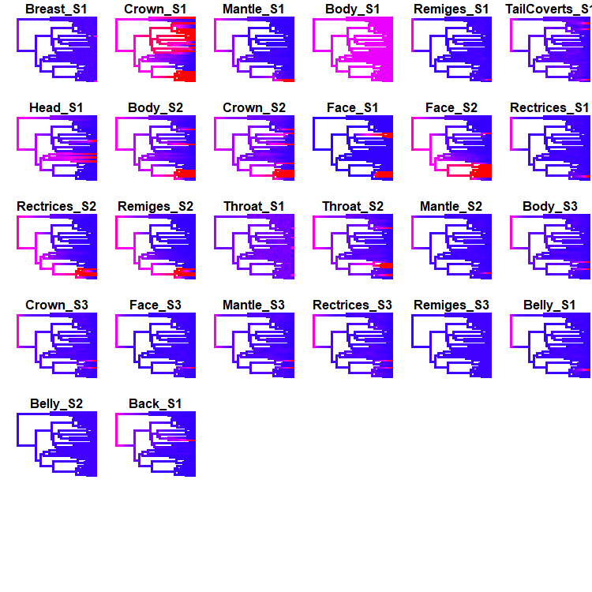

```{r setup, include=FALSE}
library(knitr)

opts_knit$set(root.dir = "C://Users/Liam/Documents/EEB654/finalproject")

setwd("C://Users/Liam/Documents/EEB654/finalproject")

library(tidyverse)
library(tools)
library(ape)
library(phytools)
library(kableExtra)

opts_knit$set(knitr.table.format="html")

STAGES_FILE <- "Data/stages_all.csv"
PLUMAGE_DIR <- "Data/Plumages/"
TREE_FILE <- "Data/pipridae_jetz_10k_consensus.nex"

PLUMAGE_STATE_CODES <- c("Absent"=0,
                         "Carotenoid"=1,
                         "Melanin"=2,
                         "Structural"=3)
```

[Note: All data wrangling and analyses fully automated in the RMarkdown file located in the base directory of this repository (`finalproject.rmd`). Knit that file to reproduce this one.]

# Introduction and Goals
Organisms with deferred reproduction forgo the production of offspring for the opportunities of development while young [@stearns1992]. In birds with delayed plumage maturation (DPM), this youthful period of reproductive delay is accompanied by a drab "predefinitive" plumage during the periods when older individuals are molting into the colorful "definitive" plumages that characterize increased reproductive effort and success. Research on DPM has largely focused on functional hypotheses for the evolution of predefinitive plumage signals (i.e., hypotheses on why it is "good to be green"). For example, the "crypsis" hypothesis suggests that drab predefinitive plumages help young males avoid predators [@selander1965; @rohwer1978] while the "social signalling" hypothesis suggests that predefinitive plumages allow young males to reduce the likelihood or costs of competition by signalling reduced reproductive capabilities [@selander1965; @lyon1986]. Studies of these functional hypotheses are limited on two fronts. First, direct benefits to instantaneous survival rate are insufficient for positive selection on the evolution of deferred reproduction, and are thus insufficient for positive selection on the "delayed maturation" part of "delayed plumage maturation" (Taylor in prep.).

Second, very little research has taken a phylogenetic view of DPM evolution. There are only two such studies. The first phylogenetic paper, by Chu [-@chu1994], found evidence that the evolution of predefinitive plumages in various shorebird taxa (Aves: Charadriiformes) was the result of the evolution of *juvenile* plumage in combination with retained partial molts. The result is that these shorebirds retain part of their juvenile plumage in their first breeding season. This study suggests that the evolution of DPM was the result of selection on juvenile plumages and constraints in molt timing, as opposed to selection on predefinitive plumages themselves. The second phylogenetic paper, by Hill [-@hill1996], found that the presence of DPM in *Haemorhous* finches is associated with a reduction in plumage patch size across species. This study recommends that reduced plumage patches are themselves associated with limits in carotenoid availability, and thus that the evolution of DPM is associated with an increase in the resource costs of plumage coloration. In opposition to functional hypotheses for the evolution of predefinitive plumage signals, phylogenetic investigations have supported constraint-based hypotheses for DPM evolution.

Manakins (Aves:Passeriformes:Pipridae) are neotropical lekking birds known for their extravagant male plumages and gymnastic sexual displays [@kirwan2011]. Manakin species also vary widely in both the presence and duration of DPM [@kirwan2011; @johnson2017]. Most research into manakin predefinitive plumages has focused on the social signalling hypothesis, and ecological and behavioral results from some species indicates that DPM may play a role in cooperative interactions as young males engage in social and sexual behavior with older individuals [e.g., @mcdonald1993]. To date, there is no phylogenetic investigation of manakin DPM which broadens these taxon-specific studies. Further, the phylogenetic conclusions of Chu [-@chu1994] and Hill [-@hill1996] cannot be applied to manakins. Unlike molt-constrained shorebirds, manakins with multiple predefinitive plumage stages have complete molts between plumages. Unlike carotenoid-restricted finches, manakins are frugivorous birds in the tropics that have ready access to food resources [@snow1971].

Thus, we have neither a family-wide view of DPM in manakins nor an evolutionary hypothesis which can underpin such a view. My goal for this project is to correct this gap. For the purposes of this class, I have three explicit sub-goals: (1) Investigate the phylogenetic distribution of the presence and duration of DPM in manakins, including estimating ancestral states; (2) Identify predefinitive plumage homologs across taxa; and (3) Perform comparative tests of the association between social characters and DPM evolution. The first two goals will hopefully open doors to additional analyses about sexual selection and discrete developmental processes in a phylogenetic context, while the third goal will directly address the standing social signalling hypotheses about DPM evolution in manakins. 

# Methods and Results

## Character Coding

I used a combination of literature reports, field guides, banding records, and photographs to code the number of DPM stages for each of 35 taxa along with the distinct (non-green) plumage patches at those stages. All taxa had 0, 1, 2, or 3 DPM stages, where a stage indicates an annual basic molt cycle that begins with the partial molt out of juvenal plumage [@wolfe2014]. For example: a taxon with a DPM stage state of 2 will be in its definitive plumage only at its 4th breeding season (including its natal season). Unique partial molts that result in characteristic plumage substages (e.g., *Chiroxiphia caudata*) were collapsed into these broader annual stages. Taxa and citations are as follows:

| Taxon | Citations |
|-------|-----------|
| *Antilophia bokermanni*| [@azevedo2000; @kirwan2011; @gaiotti2016] |
| *Antilophia galeata* | [@marini1992; @kirwan2011 |
| *Ceratopipra	erythrocephala* | [@johnson2017] |
| *Ceratopipra	mentalis* | [@wolfe2009; @kirwan2011; @johnson2017] |
| *Chiroxiphia	caudata* | [@mallet2012] |
| *Chiroxiphia	lanceolata* | [@duval2005] |
| *Chiroxiphia	linearis* | [@doucet2007] |
| *Chiroxiphia	pareola* | [@cardenas2018] |
| *Chloropipo	flavicapilla* | [@kirwan2011] |
| *Chloropipo	unicolor* | [@kirwan2011] |
| *Corapipo	altera* | [@jones2014] |
| *Corapipo	gutturalis* | [@prum1985; @johnson2017; @aramuni2019] |
| *Corapipo	leucorrhoa* | [@rosselli1994] |
| *Cryptopipo	holochlora* | [@wetmore1972] |
| *Heterocercus	flavivertex* | [@prum1996; @kirwan2011] |
| *Heterocercus	linteatus* | [@kirwan2011] |
| *Lepidothrix	coeruleocapilla* | [@kirwan2011] |
| *Lepidothrix	coronata* | [@ryder2005; @kirwan2011] |
| *Lepidothrix	serena* | [@prum1985; BotW] |
| *Lepidothrix	suavissima* | [@hilty2003; BotW] |
| *Lepidothrix	vilasboasi* | [@kirwan2011] |
| *Lepidothrix	nattereri* | [@kirwan2011; BotW] |
| *Machaeropterus	pyrocephalus* | [@hilty2003; @kirwan2011] |
| *Manacus	candei* | [@wolfe2009] |
| *Manacus	manacus* | [@johnson2017] |
| *Masius	chrysopterus* | (BotW) |
| *Neopelma	aurifrons* | [@kirwan2011] |
| *Neopelma	pallescens* | [@kirwan2011] |
| *Pipra	aureola* | [@kirwan2011] |
| *Pipra	fasciicauda* | [@robbins1985; @kirwan2011] |
| *Pipra	filicauda* | [@ryder2005; @kirwan2011] |
| *Pseudopipra	pipra* | [@johnson2017] |
| *Tyranneutes	virescens* | [@johnson2017] |
| *Xenopipo	atronitens* | [@kirwan2011] |
| *Xenopipo	uniformis* | (BotW) |

I used the data from Prum [-@prum1994] to code two binary social characters: concentrated lekking and coordinated displays. Taxa with a 0 score for concentrated lekking included both dispersed and non-lekking states, and taxa with a 1 score for coordinated displays included all of simple, coordinated, and cooperative male-male display behaviors. I supplemented some missing taxa with updated scores based on new literature reports, but most missing data is still unavailable.

```{r wrangle stages, include=FALSE}

# A function to convert binary characters into probability distributions,
#   so that we can map missing data (NA) to a 50/50 probability across two columns
probMap <- function(v) {
  if (is.na(v)) {
    return(0.5)
  } 
  return(v)
}

# Read in the raw data matrix, concatenate taxa names,
#   convert multistate stages to binaries for correlation tests,
#   and convert unknown social states to uniform priors across two columns
stagesData <- read_csv(STAGES_FILE) %>%
          unite(Taxon, Genus, Species, sep="_") %>%
          mutate(S1Binary = as.numeric(Stages>0),
                 S2Binary = as.numeric(Stages>1),
                 S3Binary = as.numeric(Stages>2),
                 Coordinated_Present = map_dbl(Coordinated, probMap),
                 Coordinated_Absent = 1 - Coordinated_Present,
                 Concentrated_Present = map_dbl(Concentrated, probMap),
                 Concentrated_Absent = 1 - Concentrated_Present)
```

I coded predefinitive plumages with non-female- and non-juvenile-like plumage patches at each DPM stage. It is necessary to code these patches as broad visual units, rather than standardized morphological components, because patches are metamodules that result from covariation across barbs and barbules within and across both feathers and feather tracts [@prum2003]. Although I initially coded patches based on broad coloration method ("Carotenoid", "Melanin", "Structural"), the analyses here collapse all coloration methods down to a binary "Present" (vs. "Absent") state. Some taxa (e.g., *Corapipo* manakins at stage 1) have a fully female-like predefinitive plumage stage which corresponds to a "Absent" score for all patches. Each taxon is associated with an individual plumage datasheet (see .csv files in the `Data` directory). These sheets are then aligned across taxa with missing data marked correctly as "Absent."

```{r wrangle plumages, include=FALSE}

# A function to parse an individual plumage record into a matrix
extractPlumageFile <- function(file) {
  taxon <- strsplit(file, "\\.")[[1]][1]

  plumage <- read_csv(paste(PLUMAGE_DIR, file, sep=""),
                        col_types = cols(.default = col_character()))

  if (nrow(plumage) == 0) {
    plumage <- bind_rows(plumage, tibble(Character="Crown", S1="Absent"))
  }
  
  plumage <- plumage %>%
          pivot_longer(-Character, 
                       names_to="Stage",
                       values_to="Value") %>%
          unite(CharacterStage, Character, Stage, sep="_") %>%
          arrange(CharacterStage) %>%
          pivot_wider(names_from=CharacterStage, 
                      values_from=Value) %>%
          purrr::map(~ PLUMAGE_STATE_CODES[.]) %>%
          as.list() %>%
          as_tibble() %>%
          mutate(Taxon=taxon, .before=1)
  
  return(plumage)
}


# Construct the plumage character matrix
plumagesData <- list.files(PLUMAGE_DIR) %>%
             purrr::map_df(extractPlumageFile)

# All patches not indicated in the original plumage tables are absent
plumagesData[is.na(plumagesData)] <- 0
```

## Backbone Phylogeny
I use a backbone phylogeny from [BirdTree](http://birdtree.org/) [@jetz2012]. This tree combines publicly available genetic data with standing taxonomic information. In my case, the use of old taxonomic information results in some important erroneous splits (e.g., the placement of *Xenopipo*, *Cryptopipo*, and *Pseudopipra*). A new tree with UCE data from all manakin species is in press [@leite2020] and will be used for this project if the results are made available before the submission deadline.

I imported a trace of 10,000 subtrees from BirdTree which were generated with the all available Pipridae taxa. I used [TreeAnnotator](https://beast.community/treeannotator) to collapse that trace into a single consensus tree for all analyses. I then prune the tree to retain only those tips for which DPM stage and predefinitive plumage characters are available.

```{r tree pruning, include=FALSE}

# Read the tree file
tree <- read.nexus(TREE_FILE)

# Refactor old taxon names which are common mislabeled across trees
refactorNames <- read_csv("Data/taxon_refactoring_names.csv")

# A function to conditionally refactor a taxon 
refactorTaxon <- function(old) {
  if (old %in% refactorNames$Taxon_Old) {
    new <- refactorNames %>%
        filter(Taxon_Old == old) %>%
        pull(Taxon_New)
    return(new)
  }
  return(old)
}
refactoredTips <- map_chr(tree$tip.label, refactorTaxon)
tree$tip.label <- refactoredTips

# Determine tips which are in the tree but not the data

treeTips <- tree$tip.label

missingTips_stages <- treeTips[!(treeTips %in% stagesData$Taxon)]
missingTips_plumages <- treeTips[!(treeTips %in% plumagesData$Taxon)]

if (length(setdiff(missingTips_stages, missingTips_plumages)) != 0) {
  stop(paste("You do not have the same tip data available for stage and plumage patches\n",
             "Here are the different tips:\n",
             paste(setdiff(treeTips_stages, treeTips_plumages), collapse="  ")))
}

treePruned <- drop.tip(tree, missingTips_stages)
```

```{r tree plot, include=FALSE}

colors <- c("0"="black", 
            "1"="green", 
            "2"="red",
            "3"="blue")

# Organize vector of stage data
stagesVector <- map_dbl(treePruned$tip.label,
                        ~ filter(stagesData, Taxon==.)$Stages[1])
names(stagesVector) <- treePruned$tip.label


png(filename="Figures/raw_tree.png", width=6, height=6, unit="in", res=400)
dotTree(treePruned, factor(stagesVector), colors=colors)
dev.off()
```

The plot below shows the pruned backbone tree. Tip labels indicate DPM stages for each taxon.
```{r, out.width = "80%", echo=FALSE}  
include_graphics("Figures/raw_tree.png")
```

## DPM Stages: Model Selection

I used a maximum-likelihood + information-theoretic approach to DPM stage evolutionary model selection. This multi-state discrete character can be modeled with a 4-state Mk model [@pagel1994]. Prior state frequencies are equal for all models. Because this character happens to have four states within Pipridae, the resulting models resemble genetic models even more closely than usual. 

I tested five models: 

```{r stage - model print prep, include=FALSE}

eru <- matrix(c("-","A","A","A",
                "A","-","A","A",
                "A","A","-","A",
                "A","A","A","-"),
              nrow=4, byrow=TRUE,
              dimnames=list(as.character(0:3), as.character(0:3)))

ero <- matrix(c("-","A","0","0",
                "A","-","A","0",
                "0","A","-","A",
                "0","0","A","-"),
              nrow=4, byrow=TRUE,
              dimnames=list(as.character(0:3), as.character(0:3)))

eao <- matrix(c("-","A","0","0",
                "B","-","A","0",
                "0","B","-","A",
                "0","0","B","-"),
              nrow=4, byrow=TRUE,
              dimnames=list(as.character(0:3), as.character(0:3)))

uso <- matrix(c("-","A","0","0",
                "A","-","B","0",
                "0","B","-","C",
                "0","0","C","-"),
              nrow=4, byrow=TRUE,
              dimnames=list(as.character(0:3), as.character(0:3)))

uao <- matrix(c("-","A","0","0",
                "B","-","C","0",
                "0","D","-","E",
                "0","0","F","-"),
              nrow=4, byrow=TRUE,
              dimnames=list(as.character(0:3), as.character(0:3)))
```

1. Equal rates unordered

```{r echo=FALSE}
noquote(eru)
```

2. Equal rates ordered 

```{r echo=FALSE}
noquote(ero)
```

3. Equal asymmetric rates ordered

```{r echo=FALSE}
noquote(eao)
```

4. Unequal symmetric rates ordered

```{r echo=FALSE}
noquote(uso)
```

5. Unequal asymmetric rates ordered

```{r echo=FALSE}
noquote(uao)
```

Note that some of these models might have implications for the broader connection between DPM evolution and e.g., sexual selection theory. For example, the "Equal Asymmetric Ordered" model would allow for the rate of stage gains to outweigh the rate of stage losses -- this ratcheting of a sexual character might be expected from e.g., Fisher's runaway process [@fisher1930].

```{r stage - model fit, include=FALSE, cache=TRUE}

# MODEL 1: Equal-rates unordered
fit_ER <- fitMk(tree=treePruned, x=stagesVector, model="ER")

# MODEL 2: Equal symmetric ordered
mat_eq_sym_ordered <- matrix(c(0,1,0,0,
                               1,0,1,0,
                               0,1,0,1,
                               0,0,1,0),4,4,byrow=TRUE)
fit_eq_sym_ordered <- fitMk(tree=treePruned, x=stagesVector, model=mat_eq_sym_ordered)

# MODEL 3: Equal asymmetric ordered
mat_eq_asym_ordered <- matrix(c(0,1,0,0,
                                2,0,1,0,
                                0,2,0,1,
                                0,0,2,0),4,4,byrow=TRUE)

fit_eq_asym_ordered <- fitMk(tree=treePruned, x=stagesVector, model=mat_eq_asym_ordered)
  
# MODEL 4: Unequal symmetric ordered
mat_un_sym_ordered <- matrix(c(0,1,0,0,
                               1,0,2,0,
                               0,2,0,3,
                               0,0,3,0),4,4,byrow=TRUE)

fit_un_sym_ordered <- fitMk(tree=treePruned, x=stagesVector, model=mat_un_sym_ordered)


# MODEL 5: Unequal asymmetric ordered
mat_un_asym_ordered <- matrix(c(0,1,0,0,
                                2,0,3,0,
                                0,4,0,5,
                                0,0,6,0),4,4,byrow=TRUE)

fit_un_asym_ordered <- fitMk(tree=treePruned, x=stagesVector, model=mat_un_asym_ordered)
```

The transition rates which maximize the likelihood of the data were estimated with the `fitMk` method in phytools [@revell2012]. The table below shows AIC scores for each model. The preferred model, which minimizes AIC, was the Equal Symmetric Ordered Model.

```{r stage - model aic, echo=FALSE}

modelList <- list(fit_ER,
                  fit_eq_sym_ordered,
                  fit_eq_asym_ordered,
                  fit_un_sym_ordered,
                  fit_un_asym_ordered)

modelNames <- c("Equal Rates Unordered", 
                "Equal Symmetric Ordered",
                "Equal Asymmetric Ordered",
                "Unequal Symmetric Ordered",
                "Unequal Asymmetric Ordered")

AICs <- map2_df(modelList, modelNames, ~ tibble(Model=.y, AIC=AIC(.x))) %>%
     mutate(dAIC = AIC - min(AIC))

print( kbl(AICs, digits=2) %>%
        kable_classic(full_width=FALSE, font_size=20, html_font="Arial") %>%
        row_spec(which(AICs$dAIC == 0), bold=TRUE, background="#D6EED4") )
```

And here are the transition rates which maximize the likelihood of DPM stage data given our chosen model constraints:

```{r stage - fit transition rates, echo=FALSE}
fitQ <- as.Qmatrix(fit_eq_sym_ordered)
round(fitQ, 3)
```

## DPM Stages: Ancestral State Estimation
Now that I have established an underlying evolutionary model, I can estimate the probability of DPM stages for internal nodes in the manakin phylogeny. Here I do this ancestral state estimation by simulating stochastic character evolution maps. I use the `make.simmap` function from phytools to simulate 1000 maps. The summary of those maps is shown below. Taxon tips are assigned to their input data state and internal nodes are colored by the proportion of simulations in a given state. Ticks along each edge indicate simulated transitions across all simulations.

```{r stage - ace sim, include=FALSE, cache=TRUE}
maps <- make.simmap(tree=treePruned,
                    x=stagesVector,
                    Q=fitQ[,],
                    nsim=1000)
summaries <- summary(maps)
```

```{r stage - ace plot, include=FALSE, cache=TRUE}
colors <- c("0"="black", 
            "1"="green", 
            "2"="red",
            "3"="blue")

png(filename="Figures/ace_tree.png", width=6, height=6, unit="in", res=300)
plot(summaries, colors=colors)
trash <- sapply(maps, markChanges, sapply(colors, make.transparent,0.01))
dev.off()
```

```{r, out.width = "80%", echo=FALSE}
include_graphics("Figures/ace_tree.png")
```

In particular, note two key internal nodes:

1. The parent node of the core manakins (i.e., the clade excluding the tyrant-manakins, *Tyranneutes* and *Neopelma*) has a high probability of Stage 1 DPM (probability = `r round(summaries$ace["37", 2],2)`).
2. The parent node of the Ilicurini subclade (i.e., the clade including *Masius*, *Corapipo*, *Chiroxiphia*, and *Antilophia*) has a majority probability of Stage 2 DPM (probability = `r round(summaries$ace["39", 3],2)`).

I can also summarize the estimated stage transitions as the mean count of transitions across all simulations:

```{r stage - mean transitions, echo=FALSE}

# A function to convert vector of transitions to a matrix, including diagonal
countVectorToMatrix <- function(v, states) {
  v <- v[-1] # remove total count
  mat <- matrix(NA, 
                nrow=length(states), ncol=length(states),
                dimnames=list(states, states))
  
  for (i in 1:length(v)) {
    r <- strsplit(names(v)[i], ",")[[1]][1]
    c <- strsplit(names(v)[i], ",")[[1]][2]
    mat[r,c] <- v[i]
  }
  return(mat)
}
sumTransitions <- colSums(summaries$count)
meanTransitions <- sumTransitions / nrow(summaries$count)

maxV <- names(meanTransitions[-1])[which(meanTransitions[-1] == max(meanTransitions[-1]))]

transitionCountMatrix <- countVectorToMatrix(meanTransitions, states=as.character(0:3))
transitionCountMatrix

```

Despite gains and losses being governed by the same rate parameter across all states, there are more gains than losses on average
(`r sum(transitionCountMatrix[upper.tri(transitionCountMatrix)])` gains vs. `r sum(transitionCountMatrix[lower.tri(transitionCountMatrix)])` losses).
 
The most frequent transition is from Stage `r strsplit(maxV, ",")[[1]][1]` to Stage `r strsplit(maxV, ",")[[1]][2]`.

## Plumage Patches: Homologies within Stages

Now that I have identified ancestral DPM plumage stages across the tree, I can take a closer look at plumage patch characters within each stage and determine whether there are homologous plumages across taxa. In this case, I can interpret homologous patches as those estimated to be present in the ancestral nodes with DPM stages. First, I can use stochastic maps to simulate the evolution of each patch at each stage as a separate binary character. I again use the `make.simmap` function to simulate the evolution of each plumage character (100 simulations per character). Each character is simulated under separate All Rates Different models.

```{r plumage - ace, include=FALSE, cache=TRUE}

# A function to generate simmap estimates for a given plumage character
simCharacter <- function(character) {
  chars <- map_dbl(treePruned$tip.label,
                   ~ filter(plumagesData, Taxon==.) %>% pull(!!character))
  
  # Convert to binary
  chars[chars > 0] <- 1
  names(chars) <- treePruned$tip.label
  
  if (all(chars==0)) {
    return(NA)
  }
  maps <- make.simmap(tree=treePruned,
                      x=chars,
                      model="ARD",
                      nsim=100)
  return(maps)
}

# Simulate each character separately
plumageCharacters <- names(plumagesData)[-1]
mapsPlumage <- purrr::map(plumageCharacters, simCharacter)
names(mapsPlumage) <- plumageCharacters

# You have to remove the character that is absent across all taxa
#   usually just Face_S3, because it is present in C. linearis S2 but absent S3,
#   so is rendered into the table during the initial data wrangling.
mapsPlumage <- mapsPlumage[!is.na(mapsPlumage)]
```

I can first view the results across all patches. The figures below show the simulation results for each character. Because these patches are now binary characters, I can view the probability density, across all simulations, for the presence of the character along every edge. Red indicates high probability of presence of a patch, blue indicates low probability.

```{r plumage - plots, include=FALSE, cache=TRUE}
colors <- c("0"="gray", 
            "1"="red")

# Plot a grid of stochastic density maps, one for each binary plumage patch character
png(filename="Figures/ace_plumages.png", width=15, height=15, unit="in", res=50)
par(mfrow=c(6,6))
for (i in 1:length(mapsPlumage)) {
  densityMap(mapsPlumage[[i]], colors=colors, ftype="off", mar=c(3,3,3,0), legend=FALSE)
  title(main=plumageCharacters[i], cex.main=3)
}
dev.off()
```

```{r plumage - show sims, out.width="80%", echo=FALSE}

```

Note the uncertain edges between the root node and its child nodes. Note also that this model seems ill-equipped to parse the evolutionary history of the Body_S1 plumage patch, which is widely distributed across the tips with many presumed gains and losses. The result is that the state of this patch is highly variable across different stochastic histories. Two further steps might make these simulations more realistic: (1) incorporating information about coloration method (i.e., Absent vs. Carotenoid/Melanin/Structural rather than Absent vs. Present) and (2) developing a model which is informed by all plumage patches simultaneously.

In the meantime, I want to consider the two key internal nodes I derived in the DPM stage ancestral state estimations: the Stage 1 ancestor of the core manakin clade and the Stage 2 ancestor of the Ilicurini subclade. What might those predefinitive plumages have looked like?

```{r plumage - key patches, include=FALSE, cache=TRUE}

# A function to retrieve the probability of all patch characters at a given node
getPatchNode <- function(p, node) {
  patchName <- names(mapsPlumage)[p]
  summary <- summary(mapsPlumage[[p]])
  Presence_Prob <- summary$ace[node, 2]
  ret <- tibble(Character=patchName, Presence_Prob=Presence_Prob)
  return(ret)
}

keyCoreAncestorPatches <- map_df(1:length(mapsPlumage), ~ getPatchNode(., "37"))
keyIlicuriniAncestorPatches <- map_df(1:length(mapsPlumage), ~ getPatchNode(., "39"))

```

Here are the highest probability predefinitive plumage patches for the core manakin ancestor:
```{r plumage - core ancestor patches, echo=FALSE, cache=TRUE}
topCore <- keyCoreAncestorPatches %>%
        arrange(Presence_Prob) %>%
        top_n(2, wt=Presence_Prob)

kbl(topCore, digits=2) %>%
  kable_classic(full_width=FALSE, font_size=20)
```

And here are the highest probability patches for the Ilicurini ancestor:
```{r plumage - ilicurini ancestor patches , echo=FALSE, cache=TRUE}
topIlic <- keyIlicuriniAncestorPatches %>%
        arrange(Presence_Prob) %>%
        top_n(3, wt=Presence_Prob)

kbl(topIlic, digits=2) %>%
  kable_classic(full_width=FALSE, font_size=20)
```

In this version of the analysis (i.e., with binary characters and separate models for each character), there are only two patches which pass even a meager 50% threshold at the ancestral DPM stage nodes. This has a reasonable biological interpretation for the core Stage 1 ancestor, which might be thought of as a "female-like" predefinitive plumage without additional patches. On the other hand, there are no female-like Stage 2 plumages in manakins. If I take the highest probability patches for each of these stages as the description of plumage, I get an ancestral core Stage 1 plumage with a crown and body patch, as well as an ancestral Ilicurini Stage 2 plumage with a face patch (in current taxa, usually a black mask). In general, this binary+separate character analysis does not show strong support any particular predefinitive plumage characters conserved across these clades which share DPM stage synapomorphies.

## Social Correlations
Finally, I want to address the hypothesis that the evolution of DPM is associated with social and sexual behaviors in manakins. In a phylogenetic context, I can extend this hypothesis to predict that there is correlated coevolution between social characters and DPM stages. To test this prediction, I can use Pagel's phylogenetic correlation method for binary, discrete characters [@pagel1994]. In particular, I will test for two sets of coevolutionary dependencies: (1) coevolution between DPM stages and concentrated lekking and (2) coevolution between DPM stages and coordinated male-male displays. As described above, I have already coded concentrated lekking and cooperative displays as binary characters. I can also convert the discrete multi-state DPM stage character to a set of binary characters. The result is three separate characters for the Presence vs. Absence of Stage 1, Stage 2, and Stage 3, respectively, for each taxon. 

```{r social correlations - prep characters, include=FALSE}

# First, convert stages to binary characters -- presence of each stage
stage1Binary <- map_dbl(treePruned$tip.label,
                        ~ filter(stagesData, Taxon==.)$S1Binary) 
names(stage1Binary) <- treePruned$tip.label

stage2Binary <- map_dbl(treePruned$tip.label,
                        ~ filter(stagesData, Taxon==.)$S2Binary) 
names(stage2Binary) <- treePruned$tip.label

stage3Binary <- map_dbl(treePruned$tip.label,
                        ~ filter(stagesData, Taxon==.)$S3Binary) 
names(stage3Binary) <- treePruned$tip.label

# Now get a matrix of concentrated lek trait coding
concentrated <- map_df(treePruned$tip.label,
                       ~ filter(stagesData, Taxon==.) %>% select(Concentrated_Present, Concentrated_Absent)) %>%
             as.matrix()
rownames(concentrated) <- treePruned$tip.label

# And a named matrix of coordinated display trait coding
coordinated <- map_df(treePruned$tip.label,
                      ~ filter(stagesData, Taxon==.) %>% select(Coordinated_Present, Coordinated_Absent)) %>%
            as.matrix()
rownames(coordinated) <- treePruned$tip.label

```

The tree below shows all of these recoded characters. From left to right, dots at the tips indicate the Presence (black), Absence (gray) or missing data (white) state for: (1) Stage 1 DPM, (2) Stage 2; (3) Stage 3; (4) Concentrated Lekking; (5) Coordinated Displays. Note the missing data in the social characters for some taxa. In the context of the Pagel discrete coevolution assessment, characters with missing data can be reinterpreted as prior probabilities of Presence or Absence. For taxa with known codings, the prior probability of the assigned state is 1. For taxa with missing data, the prior probability is 0.5 for both states.

```{r social correlations - tree plot, include=FALSE}
colors <- c("0"="white",
            "1"="gray",
            "2"="black")

multiTreeBinary <- map_df(treePruned$tip.label,
                           ~ filter(stagesData, Taxon==.) %>% select(S1Binary, 
                                                                     S2Binary,
                                                                     S3Binary,
                                                                     Concentrated, 
                                                                     Coordinated)) %>%
                as.matrix()
rownames(multiTreeBinary) <- treePruned$tip.label

multiTreeBinary <- multiTreeBinary + 1
multiTreeBinary[is.na(multiTreeBinary)] <- 0

png(filename="Figures/social_tree.png", width=8, height=6, unit="in", res=100)
dotTree(tree=treePruned, x=multiTreeBinary, colors=colors, data.type="discrete", ftype="reg", legend=FALSE)
dev.off()

```

```{r social correlations - show tree, out.width="80%", echo=FALSE}
include_graphics("Figures/social_tree.png")
```

I can now test for signs of coevolution between each of the three plumage stages and the two social characters. I use the `fitPagel` method from phytools to compare the AIC scores for two models for each pair of characters. One model asserts the independent evolution of the two paired characters. The second, more parameter-rich model assumes a dependency, where, for example, the transition from 0->1 in character X depends on the state (0 or 1) of character Y. Support for coevolution is associated with a lower AIC score for the dependent evolution model. Here, I use separate equal rates model for each pair of characters.

```{r social correlations - results, include=FALSE, cache=TRUE}

# A function to extract the AIC score from a fitMk run (not used)
tidyFitMk <- function(chars, model) {
  fit <- fitMk(tree=treePruned, x=chars, model=model)
  ll <- fit$logLik
  AIC <- AIC(fit)
  
  ret <- tibble(Model=model, lhood=ll, AIC=AIC)
  return(ret)
}

# Recode dependency settings, just
#   for aesthetic purposes in the output table
dependencyKey <- function(d) {
  if (d == "x") {
    return("X<-Y")
  } else if (d == "y") {
    return("X->Y")
  } else if (d == "xy") {
    return ("X<->Y")
  }
  return("ERROR")
}

# A function to extract key results from the fitPagel discrete correlation test
tidyFitPagel <- function(x, y, model, dep) {
  results <- fitPagel(tree=treePruned,
                      x=x,
                      y=y,
                      method="fitMk",
                      dep.var=dep,
                      model=model)
  ret <- tibble(model=model, p=results$P,
                AIC_ind=results$independent.AIC, AIC_dep=results$dependent.AIC) %>%
      mutate(dAIC = AIC_dep - AIC_ind,
             Dependency = map_chr(dep, dependencyKey))
  return(ret)
}

# Gone fishing -- Pagel tests for all dependency directions in all Stage/Social pairs
corrs_S1_Concentrated <- map_df(c("xy", "x", "y"), ~ tidyFitPagel(stage1Binary, concentrated, "ER", .)) %>%
                      mutate(Social="Concentrated", .before=1) %>%
                      mutate(Stage="S1", .before=2)

corrs_S2_Concentrated <- map_df(c("xy", "x", "y"), ~ tidyFitPagel(stage2Binary, concentrated, "ER", .)) %>%
                      mutate(Social="Concentrated", .before=1) %>%
                      mutate(Stage="S2", .before=2)

corrs_S3_Concentrated <- map_df(c("xy", "x", "y"), ~ tidyFitPagel(stage3Binary, concentrated, "ER", .)) %>%
                      mutate(Social="Concentrated", .before=1) %>%
                      mutate(Stage="S3", .before=2)

corrs_Concentrated <- bind_rows(corrs_S1_Concentrated, corrs_S2_Concentrated, corrs_S3_Concentrated)


corrs_S1_Coordinated <- map_df(c("xy", "x", "y"), ~ tidyFitPagel(stage1Binary, coordinated, "ER", .)) %>%
                      mutate(Social="Coordinated", .before=1) %>%
                      mutate(Stage="S1", .before=2)

corrs_S2_Coordinated <- map_df(c("xy", "x", "y"), ~ tidyFitPagel(stage2Binary, coordinated, "ER", .)) %>%
                      mutate(Social="Coordinated", .before=1) %>%
                      mutate(Stage="S2", .before=2)

corrs_S3_Coordinated <- map_df(c("xy", "x", "y"), ~ tidyFitPagel(stage3Binary, coordinated, "ER", .)) %>%
                      mutate(Social="Coordinated", .before=1) %>%
                      mutate(Stage="S3", .before=2)

corrs_Coordinated <- bind_rows(corrs_S1_Coordinated, corrs_S2_Coordinated, corrs_S3_Coordinated)

corrs <- bind_rows(corrs_Concentrated, corrs_Coordinated)
```

The first step is to check for a sign of coevolution in general. I do this by viewing the results of model comparison where dependency runs in both ways The table below shows the result. Negative values in the dAIC column indicate that the dependent (i.e., coevolutionary) model was preferred to the independent model.

```{r social correlations - codependency results, echo=FALSE}
coevolutions <- corrs %>%
             filter(Dependency == "X<->Y") %>%
             select(-model)

kbl(coevolutions, digits=2) %>%
  kable_classic(full_width=FALSE, font_size=20) %>%
  row_spec(which(coevolutions$dAIC < 0), bold=TRUE, background="#D6EED4")
```

Finally, I can dig a bit deeper and test for dependency directionality in the character pairs which showed some support for coevolution. The table below shows the results. I find some support for the evolutionary association between coordinated display behavior and the presence of 2 or 3 DPM stages across the manakin tree. Recall, however, that there are only two taxa with Stage 3 DPM.

```{r social correlations - directional results, echo=FALSE}

sigCorrs <- corrs %>%
         filter(Dependency != "X<->Y", p <= 0.05) %>%
         select(-model)

kbl(sigCorrs, digits=2) %>%
  kable_classic(full_width=FALSE, font_size=20)
```

# Discussion and Conclusion

To be completed for final submission.

# References

